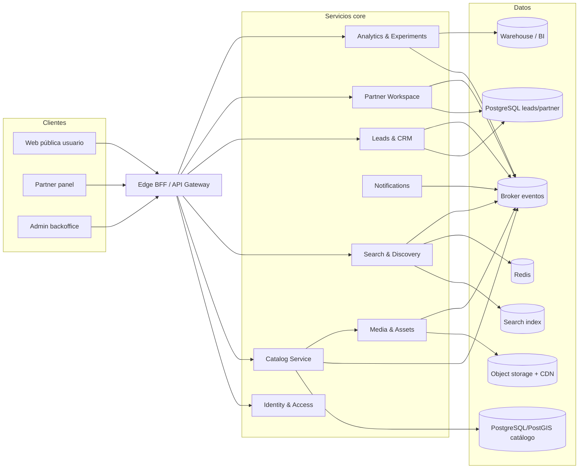
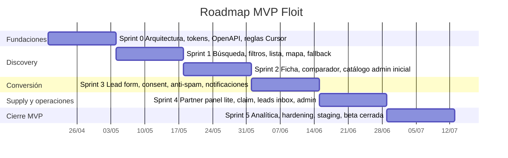

# Plan maestro para desarrollar Floit como webapp de microservicios

## Resumen ejecutivo

El análisis combinado de **“Backlog del MVP Floit.pdf”**, **“PRD_MVP_Floit_Agregador_Fitness_Caracas.docx”** y **“Floit Wireframe.zip”** muestra un producto con foco muy claro: **discovery, comparación estructurada y generación de leads** para centros de fitness en Caracas, con una capa operativa mínima para partners y backoffice, y con **pagos, reservas universales y checkout multi-centro** explícitamente fuera del core del MVP salvo pilotos controlados. El ZIP de wireframes confirma además que el producto ya tiene una base de diseño bastante madura: flujo usuario, partner panel, admin/backoffice, cobertura de Release 2 y una vista de arquitectura funcional separada del detalle visual. Esta consistencia entre backlog, PRD y wireframes es una fortaleza poco común para un MVP.

La decisión arquitectónica correcta, sin embargo, **no es “hacer muchos microservicios”**, sino **alinear pocos servicios a capacidades de negocio y dejar espacio real para evolucionar**. La literatura clásica sobre microservices insiste en organizar servicios alrededor de capacidades de negocio y bounded contexts, y también advierte que granularidad prematura añade complejidad distribuida; por eso, para Floit, recomiendo un **microservices core de 6 a 8 servicios** con contratos estrictos, comunicación ligera, una estrategia de datos por servicio donde tenga sentido, y una implementación en **monorepo con despliegue independiente por servicio**. Es la forma de respetar la visión de microservicios sin caer en un “distributed monolith”. citeturn22search1turn22search3turn4search0

La opción tecnológica más coherente para el horizonte de **8–12 semanas** es un stack **TypeScript end-to-end**: **Next.js** para la web pública y paneles, **NestJS** para servicios backend, **PostgreSQL + PostGIS** como fuente transaccional y geoespacial, **Meilisearch** como índice de discovery si el ranking y las facetas superan lo que conviene resolver solo con SQL, **Redis** para cache/rate limits, **NATS JetStream** o RabbitMQ para mensajería y eventos, y **OIDC/RBAC** vía **Keycloak** o **Auth0** para partner/admin. Este stack favorece velocidad de ejecución, consistencia de lenguaje para Cursor, SSR/SEO para fichas y landings, y una migración razonable hacia mayor complejidad operativa cuando se abran reservas, pagos o workflows más sofisticados. citeturn5search2turn5search8turn5search6turn5search4turn6search0turn9search0turn15search0

En diseño y handoff, el mejor flujo no es “Figma primero y luego código”, sino **Figma como fuente de verdad del sistema visual** y **Cursor como copiloto disciplinado dentro de límites arquitectónicos**. Figma hoy ofrece **Dev Mode**, **statuses de handoff**, **component properties**, **branching**, **Code Connect** y **MCP server** para llevar contexto estructurado de diseño a editores y agentes como Cursor. Cursor, por su lado, ofrece **project rules**, **AGENTS.md**, **codebase indexing** y modos separados para exploración versus edición, lo cual permite convertir decisiones de arquitectura, convenciones de dominio y contratos de API en contexto persistente para la IA. citeturn11search0turn0search1turn11search1turn21search0turn21search4turn1search0turn1search3turn2search3

Mi recomendación final es esta: **lanzar Floit MVP en 12 semanas**, con una arquitectura de microservicios **moderada**, no maximalista; priorizar discovery, comparación, lead generation, partner panel lite, admin y analítica base; y dejar booking/pagos para una segunda fase con patrones de orquestación más robustos. En términos de producto, tecnología y operación, ese es el camino con mejor relación entre aprendizaje, costo y riesgo.

## Hallazgos de los artefactos

Los tres artefactos son coherentes entre sí y definen un MVP con una lógica clara de mercado:

- El **PRD** define a Floit como **marketplace de discovery + comparison + lead generation** para Caracas, con enfoque **mobile-first**, hipótesis explícitas, métricas de validación y un piloto de **8 a 12 semanas**.
- El **backlog** baja esa visión a historias y criterios de aceptación, con una priorización muy bien orientada a hipótesis, no a “producto final”.
- El **ZIP de wireframes** confirma que la experiencia ya fue pensada para **usuario final**, **partner**, **admin/backoffice**, **Release 2** y **arquitectura funcional**, con variantes mobile/desktop y estados de error, vacío y carga.

De esa lectura salen cuatro verdades de producto que deben gobernar todo el plan técnico. La primera es que el core del MVP es **ayudar a decidir y contactar**, no procesar transacciones complejas. La segunda es que el catálogo y la calidad de datos son parte del producto, no una tarea “operativa” secundaria. La tercera es que el lado partner necesita autoservicio mínimo, pero la operación asistida sigue siendo central en el MVP. La cuarta es que **instrumentación, seguridad básica y performance** no son extras: están en el alcance del release inicial, al mismo nivel que búsqueda o lead forms.

### Requisitos clave, flujos y criterios de aceptación

| Área | Requisito clave extraído | Flujo principal | Criterio de aceptación resumido | Fuente interna |
|---|---|---|---|---|
| Discovery | Búsqueda por zona, municipio o cercanía | Usuario entra, comparte ubicación o escribe zona | Resultados ordenados por cercanía/relevancia; si no hay coincidencia exacta, se muestran alternativas cercanas | Backlog del MVP Floit.pdf |
| Filtros | Filtros por zona, tipo de centro, precio, modalidades, horario y amenities | Usuario busca y refina | Los filtros actualizan resultados sin perder contexto y persisten durante la sesión | Backlog del MVP Floit.pdf |
| Resultados | Vista lista + mapa | Usuario alterna lista/mapa | El universo de resultados es consistente entre ambas vistas y usable en móvil | Backlog del MVP Floit.pdf |
| Perfil de centro | Ficha detallada del gimnasio | Usuario abre ficha | Nombre, ubicación, fotos, horarios, modalidades, amenities, rango de precios y contactos visibles; CTA claro | Backlog del MVP Floit.pdf; PRD_MVP_Floit_Agregador_Fitness_Caracas.docx |
| Comparador | Comparación lado a lado | Usuario agrega centros a comparar | Comparación de hasta 3 en backlog y 4 en PRD/wireframe; campos faltantes se muestran como “no informado” | Backlog del MVP Floit.pdf; PRD_MVP_Floit_Agregador_Fitness_Caracas.docx; Floit Wireframe.zip |
| Conversión | Lead form corto | Usuario decide contactar | Formulario con nombre, teléfono, email opcional, horario e interés; validación y confirmación claras | Backlog del MVP Floit.pdf; PRD_MVP_Floit_Agregador_Fitness_Caracas.docx |
| Contacto directo | WhatsApp, llamada y email según disponibilidad | Usuario usa CTA directo | Si el canal existe, se muestra; WhatsApp debe llevar contexto mínimo del centro consultado | Backlog del MVP Floit.pdf |
| Confirmación | Registro y trazabilidad del lead | Usuario envía solicitud | Confirmación visible; el lead queda en backoffice con fecha, hora, gimnasio y canal | Backlog del MVP Floit.pdf |
| Partner onboarding | Alta o claim de perfil | Partner crea o reclama ficha | Solicitud queda pendiente de aprobación; se registra evidencia mínima de propiedad/vínculo | Backlog del MVP Floit.pdf |
| Partner CMS | Gestión básica de perfil, fotos, horarios, planes y precios | Partner edita su ficha | Cambios quedan publicados o pendientes según política; debe existir historial de última actualización | Backlog del MVP Floit.pdf |
| Partner leads | Recepción y seguimiento básico | Partner abre panel y revisa leads | Lead visible en panel y/o notificación; puede marcarse como atendido | Backlog del MVP Floit.pdf |
| Admin catálogo | CRUD + moderación | Operación crea, aprueba, archiva o despublica | Trazabilidad de quién hizo qué y cuándo | Backlog del MVP Floit.pdf |
| Taxonomía | Modalidades y amenities estandarizados | Admin gestiona atributos | Las taxonomías deben poder reutilizarse en búsqueda, comparación y ficha | Backlog del MVP Floit.pdf |
| Analítica | Eventos del funnel + dashboard MVP | Sistema registra interacciones | Eventos mínimos: búsqueda, filtros, ficha, comparador, CTA, lead, contacto directo; dashboard por zona/dispositivo/fuente | Backlog del MVP Floit.pdf; PRD_MVP_Floit_Agregador_Fitness_Caracas.docx |
| Confianza y seguridad | Consentimiento, anti-spam y roles | Usuario deja datos; operación administra | Consentimiento previo al lead, registro de aceptación, anti-spam y control de roles admin/partner | Backlog del MVP Floit.pdf |
| SEO y performance | Mobile-first, carga rápida e indexabilidad | Usuario navega y growth capta tráfico | Responsive, lazy loading, fallback del mapa, URL única por gimnasio y páginas indexables por zona/categoría | Backlog del MVP Floit.pdf; PRD_MVP_Floit_Agregador_Fitness_Caracas.docx |

A nivel de journeys, el artefacto más fuerte es la continuidad entre PRD y wireframes. El flujo de usuario es: **home/discovery → resultados lista/mapa → ficha → comparador → lead form/WhatsApp → confirmación**. El flujo partner recorre **login/claim → dashboard → edición de perfil → planes → inbox de leads**. El flujo admin cubre **dashboard operativo → catálogo → moderación → taxonomías → leads globales → métricas → roles/compliance**. En otras palabras, el backlog sí tiene representación visual y no solo conceptual.

Hay también varios puntos donde los artefactos dejan una especificación deliberadamente abierta y conviene no inventar detalles: proveedor de mapas/geocoding, PSP para pilotos de pago, CRM o herramienta analítica concreta, política de publicación “directo vs pendiente”, reglas exactas de ranking compuesto y definición formal del “perfil completo”. Esos vacíos no bloquean el MVP, pero sí deben convertirse en decisiones de arquitectura y producto durante Sprint 0–1.

## Arquitectura objetivo y microservicios

La recomendación no es construir decenas de servicios desde el día uno. La evidencia más consistente sobre microservicios sugiere organizarlos alrededor de **capacidades de negocio** y **bounded contexts**, no alrededor de tablas o endpoints, y hacerlo con cuidado porque la complejidad distribuida crece muy rápido cuando las fronteras son inmaduras. Para Floit, la combinación correcta es **microservicios con fronteras amplias y claras**, más un **BFF/API Gateway**, en lugar de fragmentar demasiado pronto. citeturn22search1turn22search3turn4search0

### Principio de diseño recomendado

La arquitectura objetivo debe ser:

- **Business-capability first**: discovery, catálogo, leads, partner, identidad, analítica y notificaciones.
- **Database per service cuando haya ownership real del dato**.
- **REST/JSON hacia el frontend**, eventos asíncronos entre servicios.
- **Outbox transactional** para evitar dual writes.
- **Choreography para eventos simples** y **orchestration solo cuando booking/pagos entren en juego**. citeturn22search0turn3search1turn3search5



### Descomposición propuesta

| Servicio | Responsabilidad | APIs externas / contratos | Modelo de datos dueño | Comunicación |
|---|---|---|---|---|
| **Edge BFF / API Gateway** | Agregación para web pública, partner y admin; auth edge; rate limits; composición de respuestas | `GET /discover`, `GET /venues/:slug`, `POST /leads`, `GET /partner/*`, `GET /admin/*` | Ninguno persistente; cache limitada | Síncrono HTTP hacia servicios; cache y feature flags |
| **Catalog Service** | Gestión de venues, sedes, horarios, modalidades, amenities, planes, estado editorial, verificación | `GET /venues/:id`, `POST /venues`, `PATCH /venues/:id`, `POST /venues/:id/publish` | `venue`, `branch`, `offering`, `schedule`, `plan`, `taxonomy_ref`, `verification_status` | HTTP con BFF; publica `venue_created`, `venue_updated`, `venue_published` |
| **Search & Discovery Service** | Facetas, ranking, geosearch, lista/mapa, ordenamiento, sugerencias por zona | `GET /search?q=&zone=&lat=&lng=&filters=...`, `GET /zones/:slug` | `venue_document`, `facet_counts`, `ranking_features` | Consume eventos de catálogo; responde HTTP al BFF; cache Redis |
| **Leads & CRM Service** | Lead forms, consent, anti-spam, estados, export CSV, historial | `POST /leads`, `GET /partner/leads`, `PATCH /leads/:id/status`, `GET /admin/leads/export` | `lead`, `lead_status_history`, `consent_record`, `spam_signal`, `lead_channel` | HTTP con BFF; publica `lead_created`, `lead_status_changed`; notifica por eventos |
| **Partner Workspace Service** | Claim/alta, ownership de venues, configuración de CTAs, SLA, panel de partner | `POST /claims`, `GET /partner/venues`, `PATCH /partner/profile`, `PATCH /partner/channels` | `partner_account`, `claim_request`, `venue_membership`, `channel_config`, `sla_rule` | HTTP con BFF; eventos `claim_approved`, `partner_updated` |
| **Identity & Access Service** | OIDC, sesiones partner/admin, RBAC, service accounts | OIDC/OAuth endpoints, JWKS, introspection | `user`, `role`, `permission`, `session`, `client` | Token-based; federable a IdP estándar | 
| **Notifications Service** | WhatsApp/email/internal notifications, plantillas, reintentos, delivery receipts | No expone APIs públicas de negocio; admin técnico opcional | `notification_job`, `template`, `delivery_attempt`, `delivery_receipt` | Consume `lead_created`, `claim_approved`, etc. |
| **Analytics & Experiments Service** | Ingesta de eventos, atribución, dashboards, A/B, agregados diarios | `POST /events`, `GET /metrics`, `GET /experiments` | `event`, `session`, `attribution`, `experiment_assignment`, `aggregate_daily` | Ingesta HTTP y/o eventos; exporta a BI |
| **Media & Assets** | Upload, transformación, moderación técnica, imagen principal | `POST /assets`, `DELETE /assets/:id`, callbacks internos | `asset`, `asset_variant`, `moderation_state`, `storage_pointer` | HTTP interno + eventos; storage/CDN |

### Responsabilidades de API y modelos que más importan

El **Catalog Service** es el dueño semántico del gimnasio; el **Search Service** nunca debe ser fuente de verdad, sino una proyección optimizada del catálogo. Esto evita dos errores habituales: editar datos “desde el índice” y mezclar necesidades de búsqueda con integridad transaccional. Esta separación es especialmente útil en Floit porque el discovery requiere geolocalización, filtros y ranking, mientras que el catálogo requiere moderación, trazabilidad y completitud editorial. Microsoft y la literatura DDD son claros en que cada bounded context debe mantener su propio modelo y lenguaje ubicuo. citeturn4search0turn4search4turn22search1

El **Leads Service** debe ser un contexto separado del catálogo porque ya tiene vida propia: consentimiento, anti-spam, canales, estado, exportación, SLA y eventualmente encuesta post-lead o booking intent. Además, los cambios de catálogo no deberían afectar retroactivamente la trazabilidad legal del lead. Para ese servicio recomiendo una tabla de **consentimiento inmutable** y **historial de estados**, más correlación por `lead_id` y `trace_id`.

El servicio de **Identity & Access** debe centrarse solo en **partner y admin** durante R1, porque los artefactos no piden login robusto para usuarios finales. Eso reduce fricción en discovery y ahorra complejidad innecesaria. En autenticación y autorización, lo correcto es apoyarse en OIDC y RBAC estándar, no implementar auth bespoke; Keycloak expone endpoints OIDC estándar y Auth0 documenta RBAC de APIs como un modelo central para permisos. citeturn9search0turn15search0

### Patrones de comunicación

Para el MVP, recomiendo este patrón:

- **Síncrono** para consultas de UI: BFF → catálogo, search, partner, leads.
- **Asíncrono** para side effects: `lead_created` dispara notificación, analítica y métricas sin bloquear la respuesta al usuario.
- **Transactional outbox** en catálogo y leads para publicar eventos solo después de confirmar la transacción.
- **Idempotencia** obligatoria en consumidores.
- **Saga orchestration no necesaria en R1**; sí necesaria cuando haya reserva, cupos o pagos multietapa. citeturn22search0turn3search1turn3search5

## Stack y flujo de trabajo con Cursor y Figma

### Stack recomendado y alternativas

| Capa | Recomendación principal | Alternativa viable | Pros | Contras | Fuente |
|---|---|---|---|---|---|
| Frontend web | **Next.js App Router** | React SPA si SEO se difiere | SSR/SSG, routing por archivos, Server/Client Components; encaja con páginas indexables de gyms y zonas | Mayor complejidad conceptual que una SPA pura | citeturn5search2turn23view8 |
| Backend microservices | **NestJS** | Fastify/Express con menos estructura | Soporte explícito para microservices, DI, interceptores, transporte request/response y eventos | Puede sentirse “framework-heavy” para servicios muy simples | citeturn5search8turn5search10 |
| DB transaccional | **PostgreSQL + PostGIS** | PostgreSQL sin índice geoespacial al inicio | SQL maduro, FTS nativo, consultas geoespaciales de cercanía | Requiere modelado y tuning cuidadoso si todo el ranking vive en SQL | citeturn5search4turn14search1 |
| Índice de discovery | **Meilisearch** cuando ranking/facetas lo justifiquen | Solo PostgreSQL FTS en el día cero | Facetas, filtros y geosearch listos; útil para discovery como producto núcleo | Un servicio más que operar y sincronizar | citeturn6search0turn5search4 |
| Cache / rate limits | **Redis** | Cache interna por servicio al comienzo | TTL, sesiones efímeras, rate limiting, caches de facetas | Otra pieza operativa; riesgo de abuso si se usa como “DB secundaria” | citeturn14search4 |
| Messaging | **NATS JetStream** | RabbitMQ; Kafka solo si luego hay event streaming pesado | Pub/sub y request-reply simples; bueno para pocos servicios y eventos de negocio | Menor ecosistema enterprise que Kafka; menos familiar para algunos equipos | citeturn5search6turn5search0 |
| Auth | **Keycloak** self-hosted o **Auth0** managed | Clerk si se prioriza velocidad UI sobre gobierno granular | OIDC estándar; RBAC claro para partner/admin | Keycloak agrega ops; Auth0 agrega costo/vendor lock-in | citeturn9search0turn15search0 |
| Mapas y geocoding | **Mapbox** | Self-hosted OSM/Nominatim más adelante | Forward/reverse geocoding y buen DX para mapas de discovery | Costo por uso; proveedor externo | citeturn13search1turn13search4 |
| Qué evitar en mapas | No usar **Nominatim público** como backend productivo | — | El servicio público tiene política de uso muy limitada | Máximo 1 req/s, no apto para carga real | citeturn13search5 |
| Infra MVP | **Cloud Run** o **ECS/Fargate equivalente** | Kubernetes cuando el número de servicios y SRE lo justifiquen | Contenedores serverless/managed reducen carga operativa inicial | Menos control fino que K8s | citeturn15search1 |
| CI/CD | **GitHub Actions** | GitLab CI u otra plataforma del repo | Workflows YAML, jobs paralelos, build/test/deploy por evento | Si no se controla bien, proliferan pipelines poco gobernados | citeturn8search0turn8search3 |
| Contratos API | **OpenAPI 3.1 + JSON Schema** | Contratos implícitos en código | Estándar formal para APIs HTTP y validación estructural | Requiere disciplina de contrato-first | citeturn20search10turn20search6 |

### Integración recomendada de Figma

Figma ya tiene suficiente capacidad como para convertirse en el eje de handoff y trazabilidad de diseño de Floit. Dev Mode permite navegación e inspección pensada para desarrollo, con estados **Ready for dev** y **Completed** para gestionar handoff; las **component properties** ayudan a reducir ambigüedad en el design system; el **branching** permite aislar cambios en librerías y experiencias antes de mergearlos; y **Code Connect** vincula componentes de diseño con componentes del repositorio para que el código expuesto en Dev Mode venga de la implementación real, no solo de codegen genérico. Además, el **Figma MCP server** conecta ese contexto directamente con editores y agentes como Cursor. citeturn11search2turn11search1turn21search0turn21search4turn0search1turn11search0

Para Floit, eso debe traducirse en un flujo muy concreto:

| Workstream | Paso | Artefacto resultante | Herramienta |
|---|---|---|---|
| Design system | Convertir los wireframes en una biblioteca base con tokens, componentes y variantes | `Floit Foundations Library` | Figma |
| Handoff | Marcar frames MVP como `Ready for dev` y asociar notas de cambio | Lista priorizada de frames implementables | Figma Dev Mode |
| Gobernanza visual | Usar branching para cambios a biblioteca y flows críticos | Branches por iniciativa: discovery, partner, admin | Figma Branching |
| Componentización | Definir `component properties` para botones, cards, filtros, banners, form fields, badges | Componentes reutilizables y menos overrides ambiguos | Figma |
| Code mapping | Conectar design system con componentes reales del repo | Mapeo Button/Card/Badge/FilterChip/FormField ↔ componentes React | Figma Code Connect |
| IA contextual | Exponer archivos o nodos de Figma a Cursor mediante MCP | Prompts con contexto de layout, variables, componentes y estados | Figma MCP + Cursor |

**Artefactos mínimos que deben salir de diseño hacia desarrollo**

- Biblioteca `Floit UI Core`
- Variables/tokens de color, spacing, radius, elevation, typography
- Especificación de estados: loading, empty, degraded map, partial info, form error, success
- Tabla de componentes conectados por Code Connect
- Mapa de páginas “Ready for dev”
- Notas de handoff por frame con criterios no visuales: analítica, permisos, estados, API dependencies

### Integración recomendada de Cursor

Cursor funciona mejor cuando el equipo **no improvisa prompts**, sino que convierte su arquitectura y convenciones en contexto persistente. Sus **Project Rules**, **AGENTS.md**, **codebase indexing** y separación entre modos de exploración y edición permiten justamente eso. citeturn1search0turn1search3turn2search3

Para Floit propongo este set inicial de artefactos en el repo:

```text
/.cursor/rules/
  architecture.mdc
  api-contracts.mdc
  frontend-nextjs.mdc
  backend-nest.mdc
  testing.mdc
  db-postgres-postgis.mdc
/AGENTS.md
/docs/adr/
/docs/domain/
/openapi/
/packages/ui/
/apps/web/
/services/catalog/
/services/search/
/services/leads/
/services/partner/
/services/auth/
/services/analytics/
```

**Contenido recomendado de las reglas de Cursor**

| Regla | Qué obliga | Para qué sirve |
|---|---|---|
| `architecture.mdc` | No mezclar ownership de datos entre servicios; eventos siempre con outbox; no acceder directo al DB de otro servicio | Evitar “distributed monolith” |
| `api-contracts.mdc` | Toda API nueva nace en OpenAPI; DTOs y validación derivados del contrato | Contrato-first |
| `frontend-nextjs.mdc` | Server Components por defecto; client components solo donde haga falta; no fetch directo a microservicios desde UI | Mantener BFF limpio |
| `backend-nest.mdc` | Controllers delgados; lógica en services/use-cases; repositorios encapsulados | Reducir acoplamiento |
| `testing.mdc` | Unit + integration + contract + E2E mínima por feature | Calidad sostenida |
| `db-postgres-postgis.mdc` | Migrations obligatorias; índices geo y texto bien justificados; sin SQL embebido arbitrario | Disciplina de datos |

**Workflow recomendado con Cursor**

- **Ask mode** para leer dominio, explorar código existente y revisar impactos antes de tocar varios servicios. citeturn2search3
- **Agent mode** para implementar una historia completa cuando ya exista ADR, contrato API y frame Ready for dev. citeturn2search3
- **Codebase indexing** activado en todo el monorepo y con `.cursorignore` para excluir builds, assets pesados y exportaciones de diseño. citeturn1search3
- **Prompts estructurados** del tipo: _“Implementa US-3.1 siguiendo `/openapi/leads.yaml`, el frame Figma X, y la regla `architecture.mdc`; genera tests y no rompas contratos existentes”_.
- **PR reviews asistidos** por Cursor, pero nunca sin pipeline ni revisión humana.

## Roadmap MVP

Asumo inicio del proyecto el **lunes 20 de abril de 2026**, con una duración de **12 semanas** en seis sprints de dos semanas. Esto es más realista que intentar meter discovery, admin, partner, analítica y seguridad en 8 semanas si además se quiere arquitectura de microservicios limpia y handoff con Figma/Cursor.

### Roadmap por sprint

| Sprint | Objetivo | Backlog dominante | Entregables | QA / criterio de salida |
|---|---|---|---|---|
| **Sprint 0** | Fundaciones de producto, arquitectura y diseño | Taxonomía, ADRs, arquitectura, design system, contratos iniciales | Monorepo, ADR-001..004, OpenAPI base, biblioteca Figma base, reglas Cursor, CI inicial | Build verde, linters, convenciones congeladas, primeros frames `Ready for dev` |
| **Sprint 1** | Discovery core | US-1.1, US-1.2, US-1.3, US-8.1, US-8.2 | Home, búsqueda, filtros, lista, mapa, fallback si falla mapa | E2E: búsqueda por zona, filtros persistentes de sesión, fallback lista cuando falla mapa |
| **Sprint 2** | Ficha y comparación | US-2.1, US-2.2, parte de taxonomías y catálogo | Ficha gym, comparador, URLs de ficha, CMS admin inicial para venues/taxonomías | E2E: abrir ficha, comparar hasta 3/4, mostrar “no informado” sin romper UI |
| **Sprint 3** | Conversión y leads | US-3.1, US-3.2, US-3.3, US-7.1, US-7.2 | Lead form, consentimiento, anti-spam, CTAs directos, confirmación, leads en backoffice, notificaciones | E2E: lead exitoso, lead inválido, rate limit, registro de consent, entrega de notificación |
| **Sprint 4** | Partner panel lite + admin operativo | US-4.1, US-4.2, US-4.3, US-4.4, US-5.1, US-5.2, US-5.3, US-8.4 | Claim, login seguro, edición de perfil, planes, inbox de leads, admin catálogo y export CSV | RBAC correcto, audit log, partner solo ve sus datos, admin ve global |
| **Sprint 5** | Analítica, métricas, endurecimiento y beta | US-6.1, US-6.2, hardening de performance, SEO mínimo si entra en alcance beta | Eventos funnel, dashboard MVP, monitoreo, staging estable, plan de beta cerrada | Eventos verificados, dashboard consistente, LCP y errores dentro de objetivo, go/no-go beta |

### Línea de tiempo



### Qué sí debe quedar fuera del MVP

Con base en PRD y backlog, y por salud del proyecto, deben permanecer fuera del core del MVP:

- checkout multi-centro
- wallet propia
- sincronización universal de reservas
- app nativa
- corporativo B2B2C completo
- recomendaciones avanzadas o ranking inteligente basado en ML

La razón no es solo alcance; es **preservar capacidad de aprendizaje**. La fase uno de Floit se gana si demuestra que discovery + comparación + contacto estructurado generan matching y valor para ambos lados. El resto solo tiene sentido después.

## Calidad, seguridad y despliegue

La calidad para Floit no puede limitarse a “que funcione”. Los artefactos exigen trazabilidad legal del lead, performance razonable, mobile-first, roles, anti-spam y analítica del funnel. Eso implica una estrategia de calidad distribuida en pruebas, observabilidad, seguridad y despliegue.

### Testing

La malla de pruebas recomendada es:

| Nivel | Alcance | Herramientas sugeridas | Qué cubre |
|---|---|---|---|
| Contrato | OpenAPI/JSON Schema | Spectral, openapi-diff, validadores JSON Schema | Compatibilidad de APIs y eventos |
| Unit | Dominio y use-cases | Vitest/Jest | Reglas de negocio sin IO |
| Integration | Servicio + DB + broker | Testcontainers / docker compose test | Persistencia, outbox, queries |
| E2E | User, partner, admin | Playwright | Paths críticos cross-service |
| Perf básica | Búsqueda, ficha, lead form | k6 o similar | Latencia, throughput y degradación |
| UAT | Product + ops | Checklist funcional | Criterios de aceptación del backlog |

Playwright es especialmente buena opción para el E2E porque auto-waits y assertions reintentables reducen la flakiness típica de flows web con estado asíncrono. citeturn18search0turn18search1

En contratos, recomiendo adoptar **OpenAPI 3.1** para REST y **JSON Schema** para payloads/eventos internos cuando aplique. Eso fortalece no solo testeo y documentación, sino también el trabajo con IA y code generation disciplinado. citeturn20search10turn20search6

### Observabilidad

OpenTelemetry define una arquitectura por señales —traces, metrics y contexto de propagación— que encaja muy bien con un MVP de microservicios. Para Floit, el mínimo aceptable es:

- `trace_id` propagado desde frontend → BFF → servicios
- spans para búsqueda, carga de ficha, submit de lead, notificación, export CSV
- métricas de latencia por endpoint y servicio
- error tracking FE/BE
- dashboards por funnel y por servicio

OpenTelemetry da la base para trazas y métricas distribuidas, y Sentry puede complementar muy bien con error/performance monitoring en frontend y Node, incluso integrándose con OpenTelemetry. citeturn8search6turn10search0turn10search4turn10search10

### Seguridad

La base de seguridad de Floit debe seguir dos marcos: **OWASP ASVS** para controles de aplicación web y **OWASP API Security Top 10** para los servicios expuestos. Esto importa especialmente porque Floit procesa PII de leads y expone APIs orientadas a objetos de negocio como venues, leads y claims. citeturn7search0turn19search0

Controles mínimos obligatorios:

- OIDC + RBAC para partner/admin. citeturn9search0turn15search0
- Audit log para publicación, despublicación, cambios de ficha, estado de lead.
- Consentimiento registrable con timestamp y versión de términos.
- Rate limiting por IP/contacto y señalización de fraude.
- Protección anti-bot en formularios; **Cloudflare Turnstile** es una opción razonable porque funciona sin CAPTCHA visual intrusivo y valida token del lado servidor. citeturn19search2turn19search5
- Secrets en secret manager, nunca en repositorio.
- Principio de mínimo privilegio en roles y service accounts.
- Cifrado en tránsito, y cifrado/reposo según proveedor de nube.

### Despliegue y operación

Para un MVP de esta naturaleza, prefiero **managed containers** al comienzo. Cloud Run, por ejemplo, está pensado para contenedores invocables por requests o eventos y reduce fuertemente el peso operativo inicial. Eso es más valioso que una plataforma hiperflexible que el equipo no tendrá tiempo de madurar en 12 semanas. citeturn15search1

El pipeline mínimo debe incluir:

- build por servicio
- tests unitarios e integrados
- chequeo de contratos OpenAPI
- análisis estático y seguridad básica
- despliegue a staging automático por `main`
- despliegue a producción con aprobación manual
- smoke tests post-deploy

GitHub Actions encaja bien porque define workflows YAML, jobs y pasos disparados por eventos del repositorio. citeturn8search0turn8search3

En performance, la métrica que sí debe gobernar la web pública es **Core Web Vitals**, en especial LCP, porque el PRD ya plantea exigencia mobile-first y páginas de discovery/ficha. Google define LCP <= 2.5 s como umbral de buena experiencia, medido en percentil 75. citeturn12search4turn12search5

## Riesgos, supuestos y mitigaciones

### Riesgos principales

| Riesgo | Impacto | Mitigación recomendada |
|---|---|---|
| Sobre-fragmentar servicios demasiado pronto | Retrasos, más bugs distribuidos, más DevOps que producto | Mantener 6–8 servicios máximos en R1; revisar fronteras después de beta |
| Datos de gimnasios incompletos o desactualizados | Pérdida de confianza y mala conversión | Score de completitud, última actualización visible, operación asistida fuerte |
| Baja respuesta de partners al lead | Se rompe la promesa de valor al usuario | SLA operativo, alertas, notificación redundante, handoff asistido por Floit |
| Discovery mediocre por mala taxonomía o ranking | Bajo uso del comparador y pobres leads | Taxonomía cerrada en Sprint 0, experimentos de ranking más adelante |
| Complejidad legal/pagos en Venezuela | Retraso del MVP | Mantener pagos fuera del core; pilotos aislados si aparecen |
| Figma/Cursor sin gobernanza | Código inconsistente o handoff confuso | Rules versionadas, ADRs, estados Ready for dev, Code Connect sólo para design system |
| Dependencia de mapas/geocoding inadecuada | Latencia, costos o bloqueo por políticas de uso | Usar proveedor productivo; no depender del Nominatim público | citeturn13search5turn13search1 |

### Supuestos explícitos porque los artefactos no los especifican

No conviene inventar estas definiciones; conviene cerrarlas formalmente en Sprint 0–1:

| Ítem no especificado en artefactos | Decisión pendiente | Riesgo si no se define |
|---|---|---|
| Proveedor de mapas y geocoding | Mapbox, Google Maps o self-hosted | Retraso en discovery y costos no controlados |
| Proveedor de auth | Keycloak, Auth0 u otro | Roles y acceso retrasados |
| Política editorial de cambios partner | Auto-publicación vs revisión manual | Inconsistencia en catálogo o cuello de botella operativo |
| Fuente inicial del catálogo | Curación manual, scraping asistido, onboarding directo | Sin densidad de oferta no existe discovery útil |
| Definición exacta de “perfil completo” | Score + campos críticos | Ranking y badges ambiguos |
| Herramienta analítica principal | PostHog, Mixpanel, GA4, warehouse propio | Eventos sin lectura de negocio |
| Canal de notificación partner | WhatsApp API oficial, email, ambos | Leads perdidos |
| Texto legal de privacidad y términos | Revisión local con counsel | Riesgo de cumplimiento |
| Modelo de moderación visual | Reglas y proceso de aprobación | Fichas de baja calidad |
| SEO scope exacto del MVP | solo fichas o también landings por zona | Trabajo de frontend/growth mal secuenciado |
| Idioma y localización futura | solo español o diseño multi-locale | Rework en copy y SEO |
| Piloto transaccional | sí/no y con qué partners | Se cuela scope de reservas/pagos demasiado pronto |

### Decisión ejecutiva recomendada

La mejor forma de desarrollar Floit como webapp fullstack con microservicios y apoyo de IA es esta:

1. **Producto**: discovery + comparación + leads como núcleo.
2. **Arquitectura**: microservicios por bounded context, pero pocos.
3. **Desarrollo**: TypeScript end-to-end, contratos OpenAPI, outbox, observabilidad desde el principio.
4. **Diseño**: Figma Dev Mode + component properties + branching + Code Connect + MCP.
5. **IA**: Cursor con reglas versionadas, AGENTS.md, indexing y prompts gobernados por ADRs.
6. **Operación**: partner/admin fuertes desde R1; pagos y reservas fuera del core.
7. **Tiempo**: 12 semanas reales para un MVP serio y medible.

Si el equipo mantiene esa disciplina, Floit puede lanzar un MVP que no solo “se ve bien”, sino que **aprende rápido, escala con orden y deja una base limpia para la fase transaccional**.