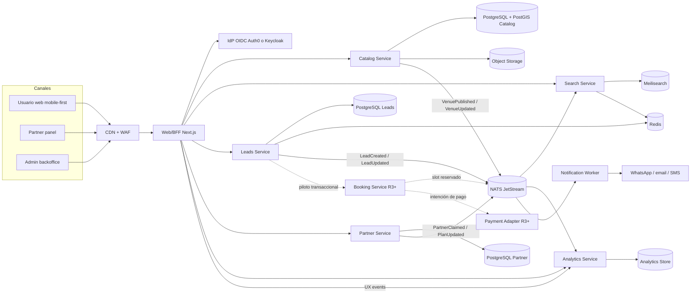
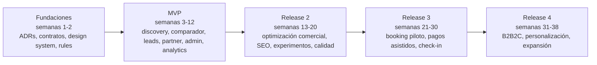

# Plan integral de prompt engineering y desarrollo para Floit

## Resumen ejecutivo

Los cuatro artefactos analizados convergen en la misma tesis de producto: Floit debe lanzarse primero como una webapp **mobile-first** para **discovery**, **comparación estructurada** y **generación de leads** para centros de fitness en Caracas, mientras que reservas universales, checkout multi-centro y pagos complejos quedan fuera del core del MVP salvo pilotos controlados. El PRD lo explicita con claridad y el backlog traduce esa tesis a historias P0/P1 y releases secuenciales; el archivo maestro ya apunta en la misma dirección y recomienda una arquitectura de microservicios moderada, no maximalista. fileciteturn0file2L11-L20 fileciteturn0file2L91-L143 fileciteturn0file1L422-L472 fileciteturn0file0L5-L13

Mi conclusión principal es que el **archivo primario “Plan maestro desarrollo floit.md” es conceptualmente correcto**, pero todavía necesitaba tres endurecimientos para ser operativo como plan de ejecución con IA: una **trazabilidad explícita** entre features y bounded contexts, una **biblioteca de prompts** por fase y tarea para Cursor y Figma, y una **gobernanza de calidad** que impida que la IA genere deuda técnica, cambios fuera de contrato o drift visual. Esa reestructuración es la que sigue en este reporte. fileciteturn0file0L17-L24 fileciteturn0file1L474-L513

La recomendación arquitectónica más sólida para Floit es un núcleo de **pocos servicios, alineados a capacidades de negocio** y con **datos propios por servicio**, evitando la trampa del “distributed monolith”. Esa postura es consistente con Martin Fowler, Microsoft y Azure: los microservicios deben organizarse alrededor de business capabilities y bounded contexts, con despliegue independiente y soberanía de datos por servicio. Para Floit, eso se traduce en **cinco servicios core del MVP** y **dos servicios opcionales para releases posteriores**. citeturn3search0turn3search1turn3search3turn3search15

En el plano operativo, la combinación más fuerte para Floit es **Figma como fuente de verdad del diseño** y **Cursor como agente de implementación gobernado por reglas, contratos y ADRs**. Figma hoy ofrece Dev Mode, estados `Ready for dev`, variables para design tokens, branching, Code Connect y MCP server; Cursor, por su parte, ofrece Rules, `AGENTS.md`, scoping por globs, contexto persistente, Plan Mode y control de indexación. Esa combinación permite pasar de wireframes a código sin perder diseño, arquitectura ni criterios de calidad. citeturn12view0turn12view2turn12view3turn12view4turn12view5turn12view6turn13view2turn2search1turn2search3

La decisión ejecutiva recomendada es esta: **construir Floit en 12 semanas para el MVP**, con un monorepo TypeScript y una arquitectura de microservicios contenida; después, correr **Release 2** para optimización comercial, **Release 3** para piloto transaccional asistido y **Release 4** para expansión B2B2C y personalización. El éxito del MVP no debe medirse por descargas ni por volumen bruto de tráfico, sino por **Qualified Intent Requests**, adopción del comparador, completitud del catálogo, SLA de respuesta partner y conversión a conversación comercial o prueba. fileciteturn0file2L873-L959 fileciteturn0file2L1147-L1202

## Lectura crítica de las fuentes y supuestos de trabajo

El PRD define con bastante precisión qué es Floit y, sobre todo, qué **no** es todavía: un agregador fitness de Caracas que reduce fricción para descubrir, comparar y activar contacto comercial, con experiencia mobile-first, medición completa del funnel y una capa mínima para partners y operaciones. También deja explícito que pagos, wallet y sincronización compleja deben mantenerse fuera del core hasta que el matching y la respuesta del supply estén probados. fileciteturn0file2L27-L85 fileciteturn0file2L91-L143 fileciteturn0file2L1037-L1063

El backlog convierte ese PRD en una secuencia razonable de construcción: **Release 1** cubre discovery, ficha, comparador, lead form, partner panel básico, admin, analítica, seguridad base, responsive/performance y RBAC; **Release 2** añade relevancia, badges, favoritos, visitas/pruebas, promociones, calidad de datos, A/B testing, encuestas, SEO y señales de verificación; **Release 3** empuja booking, pagos asistidos, check-in, recomendaciones y módulo corporativo. Esa secuencia es buena porque preserva foco en aprendizaje antes de monetización sofisticada. fileciteturn0file1L422-L472

El archivo maestro ya había llegado a una síntesis muy valiosa: Floit no debía “simular” una gran plataforma de wellness desde el primer release, sino desplegar una primera fase con discovery, comparación, leads, panel partner, admin y analítica, usando una arquitectura de microservicios prudente, un stack TypeScript end-to-end y un flujo Figma + Cursor. Mi lectura coincide con ese criterio y lo refuerza con mejores prácticas oficiales de Figma, Cursor, OpenAPI, testing, observabilidad y seguridad. fileciteturn0file0L5-L13

En paralelo, la inspección local del ZIP de wireframes confirmó algo importante para la ejecución: ya existe una base visual y estructural madura para **usuario final**, **partner**, **admin**, **release 2** y **arquitectura funcional**, por lo que el riesgo de ambigüedad de producto es menor que en un MVP típico. Eso baja el riesgo en diseño, pero sube el estándar de handoff: ahora sí conviene formalizar variables, componentes, Code Connect y estados `Ready for dev`, porque el problema ya no es “inventar la UI”, sino evitar drift entre diseño, código y criterio operativo.

Trabajo con estos supuestos explícitos para poder estimar esfuerzo y ordenar prompts:

| Supuesto | Decisión de trabajo |
|---|---|
| Tamaño de equipo | 1 tech lead, 3 engineers fullstack/backend, 1 product designer, 1 PM/product lead, 0.5 QA/DevOps |
| Stack por defecto | Monorepo TypeScript con `pnpm`, Next.js para web/BFF y NestJS para servicios |
| Cloud por defecto | Plataforma de contenedores gestionada tipo Cloud Run o ECS/Fargate; IaC con Terraform |
| Auth | OIDC externo con Auth0 o Keycloak; no construir auth propia en el MVP |
| Search | Iniciar con PostgreSQL + PostGIS y activar Meilisearch cuando facetas, ranking y geo-sorting lo justifiquen |
| Analytics | Taxonomía de eventos propia; visualización en dashboard operativo y/o herramienta gestionada |
| Handoff diseño-código | Figma Dev Mode + variables + branching + Code Connect + MCP, si el plan de Figma lo permite |
| Pagos | Solo piloto asistido en Release 3; siempre detrás de un adapter para no acoplar el dominio |

Hay una salvedad práctica importante: si el equipo quiere usar **Code Connect UI** y **branching** de Figma como parte central del workflow, necesitará planes y seats adecuados. Code Connect UI requiere library file con componentes publicados y Dev/Full seat en planes Organization/Enterprise; branching también requiere Organization/Enterprise y Full seat. Si esa infraestructura no existe, el flujo sigue siendo viable, pero con menos automatización y más handoff manual. citeturn12view2turn12view5

## Arquitectura objetivo para Floit

La arquitectura correcta para Floit no es una malla grande de servicios desde el día uno, sino una estructura alrededor de los **bounded contexts que ya aparecen en las fuentes**: catálogo y taxonomía, búsqueda y ranking, leads y consentimiento, partner operations, analytics, y luego booking/pagos como contextos tardíos. Ese corte sigue el principio de bounded context y de “data per service”, y además se ajusta a la realidad del MVP: el producto necesita aprendizaje rápido con pocos servicios bien definidos, no complejidad distribuida innecesaria. citeturn3search0turn3search1turn3search3turn3search8

La recomendación de stack es la siguiente: **Next.js App Router** para la web pública y los paneles, porque el App Router usa Server Components y favorece SSR/SEO para páginas por gimnasio y landings por zona; **NestJS** para servicios HTTP/mensajería, porque su modelo soporta transporters y aplicaciones híbridas; **PostgreSQL + PostGIS** para catálogo, zonas y cercanía; **Meilisearch** como search index separado cuando entren facetas, relevancia compuesta y geo-sorting intensivo; **Redis** para caches y rate limits; **NATS JetStream** para eventos persistentes entre servicios; **OIDC/RBAC** con Auth0 o Keycloak; y despliegue en contenedores gestionados con **Terraform** y **GitHub Actions**. citeturn4search0turn4search5turn5search0turn5search8turn17search2turn17search5turn4search3turn15search0turn15search1turn11search0turn11search1turn6search0turn6search8

La recomendación por servicio es esta:

| Servicio | Responsabilidad principal | Datos propios | APIs / eventos principales |
|---|---|---|---|
| Web/BFF | UI pública, panel partner, admin, SSR/SEO, composición de respuestas y enforcement de sesión/roles | Sin DB propia crítica | REST/JSON hacia browser; consume Catalog, Search, Leads, Partner |
| Catalog | Venues, sedes, taxonomías, amenities, horarios, estados de publicación, score de completitud, media metadata | PostgreSQL + PostGIS, storage metadata | `GET /venues`, `GET /venues/:slug`, `POST /admin/venues`, `VenuePublished` |
| Search | Facetas, ranking, ordenamiento, geosearch, relevancia y resultados list/map | Meilisearch, cache | `GET /search`, `GET /facets`, `SearchPerformed` |
| Leads | Formularios, CTA tracking, consentimiento, anti-spam, estados de lead, handoff, export operativo | PostgreSQL Leads, Redis | `POST /leads`, `PATCH /leads/:id/status`, `LeadCreated`, `LeadUpdated` |
| Partner | Claim, onboarding, edición de perfil, planes y precios, inbox de leads, SLA y respuesta | PostgreSQL Partner | `POST /partner/claim`, `PATCH /partner/profile`, `GET /partner/leads` |
| Analytics | Ingesta y modelado de eventos, KPIs del funnel, dashboards por zona/venue/fuente | Store analítico | `POST /events`, `GET /metrics/*` |
| Booking R3+ | Reserva de visita/prueba, disponibilidad, confirmación, check-in piloto | PostgreSQL Booking | `POST /bookings`, `BookingConfirmed` |
| Payment adapter R3+ | Integración desacoplada de PSP/rail local para piloto | Sin dominio core | `POST /payment-intents`, `PaymentConfirmed` |

El punto crítico de esta arquitectura no es el número de cajas, sino el contrato entre ellas. Toda sincronización de datos entre catálogo, search, leads y analytics debe salir por **eventos sobre un transactional outbox**, evitando dual writes; y cualquier flujo distribuido más sensible —como booking más pago— debe entrar a un patrón **saga** recién en Release 3. Antes de eso, el producto no necesita una orquestación transaccional compleja. citeturn3search2turn3search9turn3search12turn3search16

También conviene hacer una salvedad táctica: aunque la arquitectura objetivo es de microservicios, el equipo puede empezar el MVP con **cinco deployables** y no más. En otras palabras, el bounded context debe definirse desde el diseño y el repo, pero el despliegue físico de Search o Analytics puede simplificarse si el volumen o el equipo aún no justifican más fragmentación. Esa es una inferencia prudente a partir del propio alcance del MVP y de las advertencias clásicas contra granularidad prematura. fileciteturn0file2L718-L720 citeturn3search0turn3search15

## Roadmap por fases

Las fuentes internas ya traen una base de secuenciación bastante clara: primero discovery y operación básica; luego optimización comercial; después transacción asistida y expansión. El PRD además define métricas cuantitativas para el piloto: 40–70 venues activos, 70–85% de completitud de ficha, 15–25% de uso del comparador, 8–12% de profile-to-lead, 50–70% de respuesta partner en menos de 2 horas hábiles y 25–40% de lead a prueba o conversación comercial. Esas métricas deben usarse como criterios duros de salida del MVP. fileciteturn0file1L422-L472 fileciteturn0file2L873-L959 fileciteturn0file2L1183-L1202

| Fase | Objetivo | Alcance recomendado | Métricas de éxito | Esfuerzo estimado |
|---|---|---|---|---|
| MVP | Validar demanda y matching entre usuarios y centros | búsqueda por zona/ubicación, filtros, lista/mapa, ficha, comparador, lead form, WhatsApp/call/email, consentimiento, anti-spam, partner claim/login, partner profile/plans/leads, admin catálogo/taxonomías/leads, dashboard MVP | QIR como North Star; 40–70 venues activos; 70–85% completitud; 15–25% compare adoption; 8–12% profile-to-lead; 50–70% response SLA <2h; 25–40% lead-to-trial/conversation | 12 semanas calendario; 36–44 engineer-weeks + 10–12 design-weeks |
| Release 2 | Optimizar conversión, calidad y crecimiento | relevancia compuesta, badges, favoritos, solicitud de prueba/visita, estado del lead, promociones, duplicados, moderación visual, A/B tests, encuesta post-lead, info verificada, reportar errores, SEO por gym/zona | compare adoption >25%; CTA de prueba mejora conversión; favoritos reutilizados por cohortes; errores de catálogo resueltos <48h; orgánico creciente en páginas indexables | 8 semanas; 24–30 engineer-weeks + 6 design-weeks |
| Release 3 | Abrir piloto transaccional sin romper el dominio | booking selectivo, disponibilidad simple, confirmación, check-in verificable, pago asistido desacoplado por adapter | booking request completion >60%; confirmación <5 min; tasa de fallos operativos <2%; conciliación piloto >95% | 10 semanas; 30–38 engineer-weeks + 6 design-weeks |
| Release 4 | Escalar valor y monetización | módulo corporativo B2B2C, administración multi-sede, recomendaciones básicas, alertas, expansión geográfica selectiva | cuentas corporativas activas; retención partner; adoption de recomendaciones; revenue mix no dependiente de un único canal | 8 semanas; 24–32 engineer-weeks + 4 design-weeks |

Hay dos implicaciones prácticas importantes. La primera es que el MVP debe cerrarse con una **decision gate** real: si el comparador no mueve decisión o si el supply no responde, no tiene sentido acelerar hacia pagos. La segunda es que **Release 2 es más importante que Release 3**: en un marketplace como Floit, antes de transaccionar mejor hay que mejorar relevancia, calidad de datos, confianza y conversión. Eso está muy alineado con las hipótesis H1–H6 del PRD y con la prioridad del backlog. fileciteturn0file2L147-L212 fileciteturn0file2L963-L1001 fileciteturn0file1L490-L513

## Backlog priorizado y trazabilidad a microservicios

La tabla siguiente consolida las features realmente importantes de las fuentes y las mapea al diseño de servicios propuesto. No repite cada historia del backlog una por una; agrupa por capacidad de negocio para que desarrollo, producto y QA tengan una misma unidad de trabajo. La base documental es el backlog, el PRD y la definición de done que exige criterios de aceptación completos, diseño mobile y desktop, tracking analítico, QA funcional y estados vacíos/error definidos. fileciteturn0file1L7-L57 fileciteturn0file1L63-L172 fileciteturn0file1L174-L420 fileciteturn0file1L474-L488 fileciteturn0file2L362-L759

| Prioridad | Feature agrupada | Historias / requisitos fuente | Microservicios | Criterios de aceptación resumidos | Tipos de prueba |
|---|---|---|---|---|---|
| P0 MVP | Búsqueda por zona / ubicación | US-1.1, RF-01 | Web/BFF, Search, Catalog | Busca por GPS o zona manual; resultados ordenados por cercanía/relevancia; fallback a zonas cercanas | unit, integration, E2E, perf |
| P0 MVP | Filtros persistentes | US-1.2, RF-03 | Web/BFF, Search | Filtra por zona, tipo, precio, modalidad, horario, amenities; no pierde contexto; persiste en sesión | unit, E2E, UX QA |
| P0 MVP | Lista + mapa | US-1.3, RF-02 | Web/BFF, Search, Catalog | Universo consistente entre lista y mapa; selección cruzada entre marcador y card; usable en móvil | E2E, visual QA, perf |
| P0 MVP | Ficha de gimnasio | US-2.1, RF-06, RF-07, RF-10 | Catalog, Partner, Web/BFF | Muestra nombre, ubicación, fotos, horarios, modalidades, amenities, rango de precios, planes y CTA visible | unit, integration, E2E, visual QA |
| P0 MVP | Comparador | US-2.2, RF-11, RF-12 | Search, Catalog, Web/BFF | Compara hasta 3–4 centros; tabla/cards consistente; “no informado” cuando falte data | unit, E2E, accessibility, visual QA |
| P0 MVP | Lead form y confirmación | US-3.1, US-3.3, RF-15, RF-18 | Leads, Web/BFF | Formulario corto, validación de campos, confirmación clara, lead persistido con venue/canal/timestamp | unit, integration, contract, E2E |
| P0 MVP | Contacto directo | US-3.2, RF-16, RF-17 | Leads, Web/BFF | CTA de WhatsApp/call/email solo si existe; WhatsApp con contexto mínimo y tracking | unit, E2E, analytics QA |
| P0 MVP | Consentimiento y anti-spam | US-7.1, US-7.2 | Leads, Web/BFF | Términos visibles antes del submit, timestamp de aceptación, rate limit y flag de sospecha | security, integration, E2E |
| P0 MVP | Claim y acceso partner | US-4.1, RF-20 | Partner, Auth | Claim crea solicitud pendiente; evidencia mínima; login seguro con OIDC o magic-link federado | security, integration, E2E |
| P0 MVP | Perfil, planes y precios partner | US-4.2, US-4.3, RF-21 | Partner, Catalog | Edita datos, fotos, horarios, modalidades, planes y precio/rango/consultar; historial de actualización | unit, integration, E2E |
| P0 MVP | Inbox de leads partner | US-4.4, RF-22 | Partner, Leads | Lead visible en panel y/o notificación; estado manual de atención | contract, integration, E2E |
| P0 MVP | Admin catálogo y taxonomías | US-5.1, US-5.2, RF-25, RF-26 | Catalog | CRUD, aprobación, rechazo, borrador, taxonomías reutilizables y trazabilidad de cambios | unit, integration, admin E2E |
| P0 MVP | Leads backoffice y export | US-5.3, RF-27, RF-29 | Leads, Analytics | Lista por fecha/gimnasio/estado/canal; filtros; export CSV; trazabilidad mínima | unit, integration, E2E |
| P0 MVP | Instrumentación y dashboard | US-6.1, US-6.2 | Analytics | Registra búsqueda, filtros, ficha, comparador, CTA, lead, contacto directo; dashboard por zona/dispositivo/fuente | contract, data QA, E2E |
| P0 MVP | Mobile-first, performance y RBAC | US-8.1, US-8.2, US-8.4 | Todos | Responsive, lazy loading, degradación elegante, roles partner/admin correctamente aplicados | perf, security, E2E |
| P1 R2 | Relevancia, badges y favoritos | US-1.4, US-2.3, US-2.4 | Search, Catalog, Web/BFF | Ranking compuesto, badges basados en reglas transparentes, favoritos persistentes y comparables | unit, E2E, analytics QA |
| P1 R2 | Visita / prueba y estado del lead | US-3.4, US-3.5 | Leads, Partner | CTA condicional, preferencia fecha/hora, estado visible al menos en operación interna | contract, integration, E2E |
| P1 R2 | Calidad de datos y moderación visual | US-5.4, US-5.5, US-7.3, US-7.4 | Catalog | Duplicados potenciales, perfiles incompletos, moderación de fotos, info verificada y reporte de errores | unit, admin E2E, ops QA |
| P1 R2 | Experimentación, encuesta y SEO | US-6.3, US-6.4, US-8.3 | Analytics, Web/BFF, Search | A/B testing de CTA/forms, encuesta post-lead y páginas indexables por gym/zona | data QA, E2E, SEO QA |
| P1/P2 R3+ | Booking, pago asistido, check-in | RF-30 a RF-33, backlog Release 3 | Booking, Payment adapter, Leads | Reserva en venues piloto, disponibilidad simple, pago desacoplado, check-in verificable | contract, integration, E2E, ops QA |

La consecuencia organizativa de esta tabla es importante: el backlog de Floit no debería administrarse como una simple lista de pantallas ni como tickets sueltos por stack, sino como **capability slices** que atraviesan diseño, contrato, backend, frontend, medición y QA. Eso es especialmente importante si se va a trabajar con Cursor: prompts por capa aislada tienden a crear piezas incongruentes; prompts por capability producen vertical slices más coherentes.

## Biblioteca de prompts para Cursor y Figma

Las mejores prácticas oficiales convergen en el mismo patrón: instrucciones claras, contexto explícito, ejemplos o archivos de referencia, salida estructurada y validación sistemática. OpenAI recomienda dar instrucciones precisas, dividir tareas complejas, aportar contexto de referencia y probar cambios sistemáticamente; además, Structured Outputs permite forzar respuestas que respeten un JSON Schema. Cursor recomienda reglas enfocadas y accionables, con `Project Rules`, `AGENTS.md`, referencias a archivos y reglas cortas/componibles; Figma, por su lado, permite pasar contexto estructurado a agentes mediante Dev Mode, Code Connect y MCP server. citeturn9search0turn9search8turn16search2turn16search3turn13view2turn12view2turn12view3turn12view7

Hay una aclaratoria útil: **Cursor no documenta públicamente el control fino de “temperature” como parte central de su workflow**, así que las recomendaciones de temperatura de esta sección deben entenderse como **ajustes del modelo subyacente cuando existan** o, si no existen, como un proxy de comportamiento: usar menor temperatura equivale a pedir salidas más deterministas, con formato estructurado, menos alternativas y mayor validación. Donde sea posible, para contratos, tests e infraestructura conviene operar en equivalente a `0.0–0.2`; para exploración UX o variantes de copy, `0.3–0.6` es más útil. citeturn16search3turn16search9

### Prompts recomendados para Cursor

| Fase | Tarea | Prompt base | Entradas esperadas | Salida esperada y validación | Ajustes |
|---|---|---|---|---|---|
| Fundaciones | Arquitectura inicial | **“Usa `@/docs/prd.md`, `@/docs/backlog.md`, `@/docs/plan-maestro.md` y las reglas `@.cursor/rules/architecture.mdc` y `@AGENTS.md`. Diseña el monorepo `pnpm` de Floit con `apps/web`, `packages/ui`, `packages/contracts`, `services/catalog`, `services/search`, `services/leads`, `services/partner`, `services/analytics`. Entrega: ADR-001 de arquitectura, árbol de carpetas, dependencias por paquete, contrato de eventos y lista de riesgos. No escribas código todavía; produce un plan revisable.”** | PRD, backlog, plan maestro, decisiones cloud | ADR, estructura repo, eventos, riesgos; validar en revisión de arquitectura antes de crear código | Cursor **Plan Mode**; temp 0.1–0.2; salida en Markdown + JSON resumen |
| Fundaciones | Reglas y contexto persistente | **“Crea las reglas de Cursor para Floit. Necesito `architecture.mdc`, `api-contracts.mdc`, `frontend-nextjs.mdc`, `backend-nest.mdc`, `testing.mdc` y `db-postgres-postgis.mdc`. Cada regla debe ser corta, concreta, con globs y ejemplos de archivos, y no superar 250 líneas. Además crea `AGENTS.md` global y sub-`AGENTS.md` para `apps/web` y `services/*`.”** | Stack elegido, convenciones de equipo | Reglas creadas; validar que están por debajo del tamaño objetivo y sin duplicación | Agent; temp 0.1 |
| MVP | Contratos API | **“A partir de US-1.1 a US-3.3 y RF-01 a RF-18, genera primero los contratos `OpenAPI 3.1` para Search, Catalog y Leads, y esquemas JSON para eventos `VenuePublished`, `LeadCreated`, `LeadUpdated`. No implementes lógica aún. Incluye ejemplos de request/response, errores y reglas de compatibilidad backward.”** | Historias, taxonomía, dominios | Archivos `/openapi/*.yaml` y `/contracts/events/*.schema.json`; validar con lint de OpenAPI y revisión de contratos | Agent; temp 0.0–0.1; salida estructurada |
| MVP | Scaffolding frontend | **“Usa `@/openapi/search.yaml`, `@/openapi/catalog.yaml`, `@/packages/ui`, y los frames Figma marcados `Ready for dev`. Implementa el scaffold de `apps/web` con Next.js App Router para `/`, `/buscar`, `/gyms/[slug]`, `/comparar` y `/lead/confirmacion`. No consumas microservicios directamente desde componentes cliente: usa route handlers o server components. Agrega estados loading/error/empty y tracking placeholders.”** | Contratos API, componentes UI, frames Figma | Rutas base, layouts, componentes shell, fetch server-side; validar build, lint y screenshot QA | Agent; temp 0.1–0.2 |
| MVP | Catalog service | **“Implementa `services/catalog` en NestJS siguiendo el contrato `catalog.yaml`. Usa PostgreSQL + PostGIS, migraciones, repositorios encapsulados y outbox. Cubre venues, taxonomías, score de completitud y publicación. Incluye seeds mínimas para Caracas. No mezcles lógica de search ni de leads.”** | `catalog.yaml`, reglas backend/db, modelo de datos | Servicio funcional con migraciones, tests unitarios e integration tests; validar queries geo y publish events | Agent; temp 0.1 |
| MVP | Search service | **“Implementa `services/search`. Debe soportar texto + filtros + ordenamiento + mapa. Usa Meilisearch si mejora facetas y geo-sorting; si no, deja interfaz desacoplada y empieza con PostgreSQL. Sincroniza por eventos desde Catalog usando outbox + consumer. Entrega estrategia de ranking inicial y tests.”** | `search.yaml`, reglas architecture/db, eventos de catálogo | Endpoint search funcional, sync consumer, ranking inicial; validar filtros, facetas y latencia | Plan Mode primero, luego Agent; temp 0.1 |
| MVP | Leads service | **“Implementa `services/leads` con formulario corto, consentimiento obligatorio, rate limiting, anti-spam y tracking de CTA. Integra validación server-side del challenge anti-bot, persistencia de `consent_version`, router de leads y worker de notificaciones. Genera además el estado inicial `recibida` y el export CSV para backoffice.”** | `leads.yaml`, política de privacidad, reglas testing/security | Persistencia, validación, notificación y export; validar flows feliz/error/abuso | Agent; temp 0.0–0.1 |
| MVP | Partner service y auth | **“Implementa `services/partner` y conecta el webapp a OIDC/RBAC. Cubre claim, edición de perfil, planes/precios e inbox de leads. Un partner solo puede ver sus venues y sus leads. Entrega guards, policies, pruebas de autorización y casos negativos.”** | Contrato partner, mapeo roles, provider OIDC | Endpoints partner + guards + tests de autorización; validar BOLA/BFLA y RBAC | Agent; temp 0.1 |
| MVP | Testing completo | **“Genera malla de pruebas para la capability `buscar → ficha → comparar → lead`. Necesito unit tests, integration tests con testcontainers, contract tests de OpenAPI y E2E con Playwright. No uses sleeps fijos; usa locators y assertions reintentables. Produce también datos de prueba reutilizables.”** | Contratos, servicios implementados, URL preview | Suite ejecutable en CI; validar cobertura de caminos críticos y estabilidad E2E | Agent; temp 0.0–0.1 |
| MVP | CI/CD e IaC | **“Crea pipelines GitHub Actions para lint, typecheck, unit, integration, contract y E2E por PR; build y deploy por merge a `main`; preview env por PR; promoción a staging y producción con approvals. Genera Terraform modular para red base, servicios, DB, cache, secretos y observabilidad. Entrega README operacional y rollback básico.”** | Cloud target, naming, secretos, módulos | `.github/workflows/*`, `infra/terraform/*`, runbook; validar `terraform validate`, pipeline verde y smoke tests | Agent; temp 0.0–0.1 |
| Release 2 | Relevancia, favoritos, SEO y experimentos | **“Implementa Release 2 sobre bounded contexts existentes: ranking compuesto, favoritos persistentes, badges basados en reglas transparentes, CTA de visita/prueba, estado de lead, páginas indexables de gym y zona, y A/B tests de CTA/form. Mantén compatibilidad backward. Entrega migraciones, contratos actualizados y experiment flags.”** | backlog R2, contratos actuales, métricas MVP | Changesets por servicio, flags, páginas SEO, tests A/B y data QA | Plan Mode + Agent; temp 0.1–0.2 |
| Release 3 | Booking y pago asistido | **“Diseña e implementa el piloto de booking. Crea `services/booking` y un `payment-adapter` desacoplado. Usa saga solo donde haya booking + pago. Mantén el dominio de leads intacto. Entrega ADR, contrato, machine states, compensaciones y pruebas de consistencia.”** | pilotos, venues elegidos, rail de pago | ADR, estados, servicios y pruebas; validar idempotencia y fallos parciales | Plan Mode + Agent; temp 0.1 |
| Release 4 | B2B2C y recomendaciones | **“Propón la evolución a B2B2C sin romper el modelo actual. Entrega diseño para cuentas corporativas, administración multi-sede, reporting por empleado y recomendaciones básicas explicables. Separa claramente lo que es nuevo bounded context de lo que es extensión de analytics o catalog.”** | resultados previos, datos de uso | ADR de expansión, contratos preliminares y roadmap técnico | Plan Mode; temp 0.2–0.3 |

### Prompts recomendados para Figma

| Fase | Tarea | Prompt base | Entradas esperadas | Salida esperada y validación | Ajustes |
|---|---|---|---|---|---|
| Fundaciones | Sistema visual base | **“Convierte estos wireframes de Floit en una biblioteca `Floit UI Core`. Necesito variables de color, spacing, radius, typography y elevation; componentes base para button, input, filter chip, card de gimnasio, badge, table/comparison card, form field, empty state y banners. Usa variables y component properties; evita overrides manuales innecesarios.”** | wireframes actuales, branding, reglas de accesibilidad | Library con tokens y componentes; validar consistencia entre mobile y desktop | temp equivalente 0.3 |
| Fundaciones | Preparar handoff | **“Crea una branch de handoff MVP. Marca como `Ready for dev` los frames navegables del flujo usuario, partner y admin que correspondan al Release 1. En cada frame agrega notas de: estados vacíos/error, eventos analíticos, permisos requeridos y dependencias API.”** | backlog Release 1, library base | Frames listos para desarrollo y anotados; validar con product + tech lead | temp 0.2 |
| MVP | Conexión diseño-código | **“Mapea los componentes de la biblioteca `Floit UI Core` con el código real del repositorio usando Code Connect. Prioriza `Button`, `GymCard`, `FilterChip`, `FormField`, `Badge` y `ComparisonCard`. Si usas el servidor remoto, etiqueta el framework como `React`.”** | library, repo, rutas de componentes | Code Connect mappings; validar que el repositorio correcto esté conectado y que los componentes reutilicen snippets reales | temp 0.1 |
| MVP | Contexto MCP para dev | **“Prepara los frames MVP para MCP. Asegúrate de que cada pantalla clave tenga nombres semánticos, jerarquía limpia, variables aplicadas y componentes conectados. Necesito que un agente pueda extraer variables, layout y mappings de código sin ambigüedad.”** | library, frames MVP | Archivo Figma limpio para `get_variable_defs`, `get_code_connect_map` y generación de código | temp 0.2 |
| Release 2 | Variantes de optimización comercial | **“En una branch de Release 2, diseña variantes para ranking, badges, favoritos, solicitud de prueba, estado del lead y landings SEO por zona. Cada variante debe incluir hipótesis, métrica esperada y nota de experimento.”** | resultados MVP, hipótesis H1–H6 | Frames R2 listos y anotados; validar con PM y Growth | temp 0.4 |
| Release 3 | Booking y pago piloto | **“Diseña el flujo de visita/prueba reservable para venues piloto. Necesito estados para selección de slot, confirmación, error, reprogramación, pago asistido opcional y check-in. Señala claramente qué partes son MVP extendido y cuáles son piloto.”** | reglas operativas, venues piloto | Flujos de booking claros y escalables; validar con Ops | temp 0.3 |
| Release 4 | Corporativo y personalización | **“Diseña los shells y journeys base para cuentas corporativas: admin empresa, empleado, activación, reporting y recomendaciones. Mantén compatibilidad visual con la library existente y separa nuevas entidades B2B2C de las vistas B2C.”** | métricas y aprendizajes previos | Flujos R4 y extensiones de library; validar con stakeholders B2B | temp 0.4 |

Hay dos recomendaciones adicionales para que estos prompts funcionen mejor en la práctica. La primera es que los prompts de Figma y Cursor **siempre deben referenciar la misma unidad de trabajo**: por ejemplo, un frame `Ready for dev`, un set de historias `US-3.1–US-3.3`, un contrato OpenAPI y una capability vertical. La segunda es que, cuando trabajes con Figma MCP, recuerdes que el prompting por **selección** funciona con el servidor desktop, mientras que el servidor remoto requiere referenciar un frame o layer por link; además, si quieres que el MCP devuelva el mapping de Code Connect correcto en remoto, conviene usar el label exacto del framework configurado, como `React`. citeturn12view7turn0search15

## Flujo operativo, QA, checklist y fuentes priorizadas

El workflow recomendado para Floit es un ciclo corto pero disciplinado: **descubrir → formalizar → diseñar → conectar → implementar → verificar → liberar → medir**. En términos concretos, eso significa que ninguna historia entra directamente a Cursor sin antes pasar por backlog refinado, frame Figma listo, criterio de aceptación claro y contrato/API o decision record cuando haga falta. Figma Dev Mode y los estados `Ready for dev` sirven para controlar el handoff; Cursor Plan Mode sirve para preparar cambios grandes antes de escribir código; GitHub Actions automatiza la verificación; y Playwright actúa como red de seguridad sobre los caminos críticos user/partner/admin. citeturn12view0turn12view4turn2search1turn6search0turn6search8turn6search1

| Etapa | Gate de entrada | Herramienta dominante | Gate de salida |
|---|---|---|---|
| Refinamiento | historia INVEST, criterio de aceptación, owner claro | Backlog / PRD | capability aprobada |
| Diseño | branch de Figma, variables/componentes correctos | Figma | frames `Ready for dev` + notas |
| Contrato | ADR y/o OpenAPI/JSON Schema definidos | Cursor Plan Mode + revisión humana | contrato aprobado |
| Implementación | reglas Cursor activas, scope bien delimitado | Cursor Agent | diff revisado + tests locales |
| Integración | pipelines, previews, data fixtures | GitHub Actions | CI verde |
| QA/UAT | E2E, accesibilidad, mobile, estados, métricas | Playwright + QA manual | sign-off producto/ops |
| Release | migraciones, smoke tests, rollback | CI/CD + Terraform | despliegue estable |
| Medición | eventos coherentes y dashboards | Analytics | decisión de iteración |

La lista mínima de chequeo para producción debe cubrir seguridad, escalabilidad, observabilidad y privacidad desde el MVP, porque las propias fuentes internas lo elevan a requisito no funcional. Además, OWASP ASVS y OWASP API Security Top 10 son la base adecuada para una aplicación que expone APIs y procesa PII de leads; OpenTelemetry da el estándar de traces/metrics/logs; y Core Web Vitals ponen el estándar de performance web para mobile-first. fileciteturn0file2L723-L759 citeturn6search2turn7search0turn6search7turn18view0turn18view1

| Dominio | Checklist recomendado |
|---|---|
| Seguridad | OIDC/RBAC para partner/admin; autorización por objeto en venues/leads; audit log de publish/unpublish y cambios de estado; validación server-side del anti-bot; rate limiting por IP/contacto; secretos fuera del repo; revisión de dependencias; pruebas negativas para acceso cruzado |
| Escalabilidad | índices geoespaciales; separación catálogo/búsqueda; cache de facetas/resultados; sync por outbox; colas para notificaciones; autoscaling por servicio; storage de media fuera de DB; no usar Nominatim público como backend productivo |
| Observabilidad | `trace_id` propagado end-to-end; spans para search/ficha/lead/notificación/export; métricas por endpoint y por servicio; dashboard de funnel; error tracking FE/BE; alertas de SLA partner y fallos de jobs |
| Privacidad | minimización de datos en leads; versión de términos y timestamp; finalidad explícita del contacto; retención definida; ubicación solo cuando aporte valor al match; acceso interno por necesidad operativa; export/borrado trazable |
| Calidad web | LCP ≤ 2.5 s, INP < 200 ms, CLS < 0.1; lazy loading; SSR/SEO en páginas de gym y zona; fallback elegante ante fallo de mapas o integraciones externas |
| Testing | unit + integration + contract + E2E + smoke deploy; sin sleeps fijos en Playwright; fixtures realistas; revisión manual en móvil; validación de métricas instrumentadas |

Tres detalles merecen destacarse. Primero, **Playwright** es una buena base para Floit porque sus waits y assertions reintentables reducen flakiness en flows web asíncronos. Segundo, para el anti-spam conviene usar un mecanismo con **verificación server-side** y tokens efímeros, no solo un widget del lado cliente. Tercero, si se usa geocoding con OpenStreetMap, no debe apoyarse el backend productivo en el **Nominatim público**, cuya política de uso es restrictiva; para producción conviene Mapbox o una instancia propia/gestionada. citeturn6search1turn15search2turn15search10turn5search3turn5search11

Las fuentes priorizadas que sostienen este plan son, en orden práctico de uso:

- **Fuentes internas de producto**: PRD, backlog y plan maestro de Floit. fileciteturn0file2L11-L20 fileciteturn0file2L873-L959 fileciteturn0file1L422-L488 fileciteturn0file0L5-L13
- **Figma oficial** para Dev Mode, handoff, variables, branching, Code Connect y MCP. citeturn12view0turn12view2turn12view3turn12view4turn12view5turn12view6turn12view7
- **Cursor oficial** para Rules, `AGENTS.md`, scoping y flujo de prompting/planificación. citeturn13view2turn2search1turn2search3turn11search2
- **Arquitectura de microservicios**: Martin Fowler, Microsoft/Azure y AWS para bounded contexts, data sovereignty, outbox y saga. citeturn3search0turn3search1turn3search3turn3search15turn3search2turn3search12
- **Stack y despliegue**: Next.js, NestJS, Meilisearch, NATS, Terraform, Cloud Run y GitHub Actions. citeturn4search0turn4search5turn17search2turn17search5turn4search3turn11search0turn11search1turn6search0turn6search8
- **Prompt engineering y contratos**: OpenAI prompt best practices y Structured Outputs con JSON Schema/OpenAPI. citeturn9search0turn9search8turn16search3turn5search1turn5search5
- **Testing, security, observability y web performance**: Playwright, OWASP, OpenTelemetry, Google/web.dev. citeturn6search1turn6search2turn7search0turn6search7turn18view0turn18view1
- **Auth, anti-spam y mapas**: Auth0/Keycloak, Cloudflare Turnstile y política de Nominatim/Mapbox. citeturn15search0turn15search1turn15search10turn15search2turn5search3turn5search11

**Preguntas abiertas y limitaciones.** La principal limitación de este trabajo es que el ZIP de wireframes no estaba indexado para citación línea a línea, así que su análisis se apoyó en inspección local directa y en la corroboración cruzada con el plan maestro. Adicionalmente, siguen abiertas decisiones de proveedor en tres frentes: mapas/geocoding, canal exacto de WhatsApp/notifications y rails locales para el piloto de pagos. Finalmente, las métricas del MVP están ancladas al PRD; las métricas de Release 2–4 son recomendaciones de ejecución, no metas ya aprobadas por las fuentes internas.