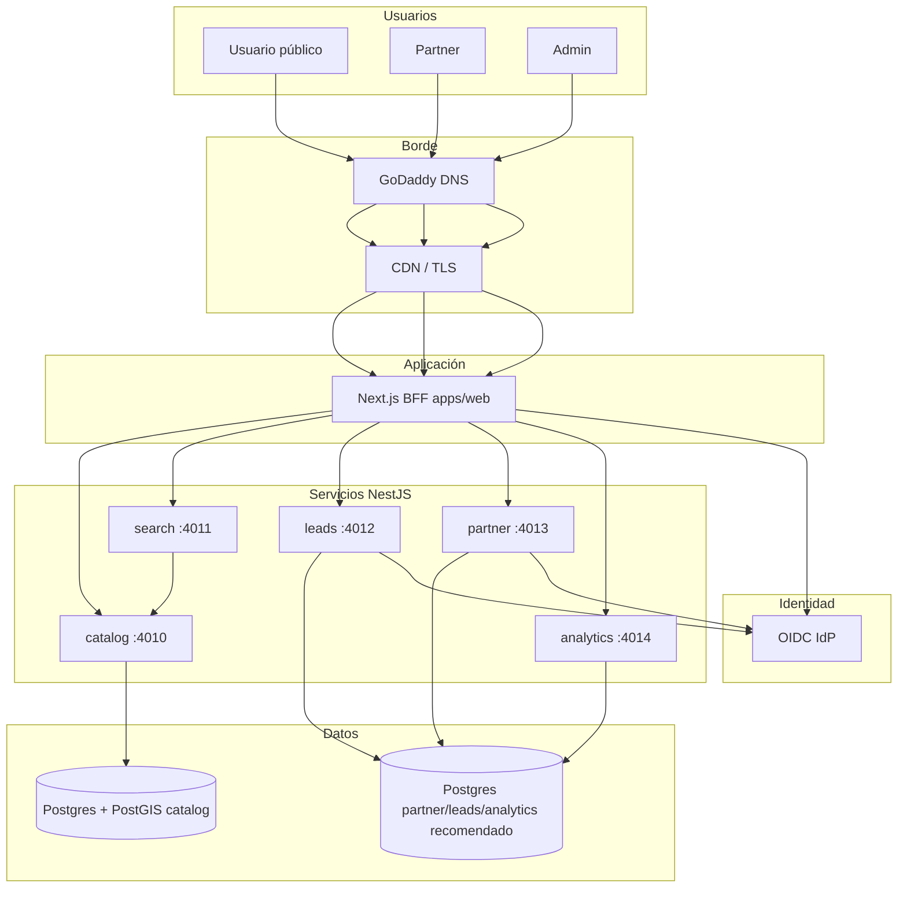

# Plan de lanzamiento a producción — QueGym (`www.quegym.com`)

Documento de planificación para publicar el MVP en **https://www.quegym.com** (dominio en GoDaddy), con administración segura y operación continua. Complementa [`DEPLOY_TEST_RUNBOOK.md`](./DEPLOY_TEST_RUNBOOK.md), [`oidc-rollout-sprint4.md`](./oidc-rollout-sprint4.md) y las plantillas de evidencia Sprint 4/5.

**Estado del repo (mayo 2026):** runtime probado en local (95 venues, smoke/E2E); **no hay** Dockerfiles ni IaC de producción en el monorepo. Este plan define qué construir antes del cutover DNS.

---

## 1. Objetivo y criterios de éxito

| Objetivo | Criterio medible |
|----------|------------------|
| Producto público en marca **QueGym** | `https://www.quegym.com` resuelve con TLS válido; home, `/buscar`, fichas, comparar, leads operativos |
| Partner y admin operables | Login OIDC (sin passwords en env de prod); flujos claim, panel, leads admin |
| Datos de catálogo | ~95 centros en Postgres de producción; import idempotente documentado |
| Seguridad MVP | Sin `ADMIN_API_TOKEN` / logins locales en prod; Turnstile recomendado en leads |
| Operación | Health checks, backups DB, runbook de incidentes, monitoreo básico |

**No es objetivo de este lanzamiento:** checkout, pagos, broker de eventos externo, multi-región, Fase 2–3 del rebrand técnico (`@quegym/*`, cookies renombradas).

---

## 2. Prerrequisitos (bloqueantes antes de producción)

Completar **en staging** (mismo stack que prod, datos no productivos):

1. **Gates técnicos** (con URLs de staging, no localhost):
   - `pnpm sprint4:gate` → PASS
   - `pnpm sprint5:flow-checklist` → PASS
   - `pnpm sprint5:kpi-gate` → PASS (umbrales acordados con producto)
2. **Evidencia firmada:** [`STAGING_EVIDENCE_SPRINT4.md`](./STAGING_EVIDENCE_SPRINT4.md), [`STAGING_EVIDENCE_SPRINT5.md`](./STAGING_EVIDENCE_SPRINT5.md) → decisión **GO**.
3. **OIDC real:** IdP de producción (Auth0, Keycloak, Clerk, etc.) con apps **admin** y **partner**; redirect URIs de staging y prod.
4. **Catálogo:** `pnpm venues:load` (o normalize + import) contra **Postgres de staging**; QA en `/buscar` y `/admin/catalogo`.
5. **CI verde** en `main`: `pnpm verify` + job E2E con servicios (ver `.github/workflows/ci.yml`).

Sin GO de staging, **no** apuntar `www.quegym.com` a producción.

---

## 3. Arquitectura objetivo en producción



### Componentes del monorepo

| Componente | Rol en prod | Notas |
|------------|-------------|--------|
| `apps/web` | **Único host público** (`www.quegym.com`) | BFF `/api/*`; `NEXT_PUBLIC_SITE_URL=https://www.quegym.com` |
| `catalog-service` | Fuente de verdad venues, taxonomías, fotos admin | **Postgres + PostGIS** obligatorio; `DATABASE_SYNC=false` en prod |
| `search-service` | Discovery | Sin DB propia; `CATALOG_SERVICE_URL` interno |
| `leads-service` | Leads + admin leads API | Postgres recomendado; eventos a analytics |
| `partner-service` | Claims, ownership, sync catálogo | Hoy SQLite en local → **migrar a Postgres o volumen persistente** antes de prod |
| `analytics-service` | KPIs / embudo | Hoy SQLite en local → Postgres o servicio gestionado |

### Brecha explícita del repo

- No existen **Dockerfile** ni **compose de producción**; hay que añadirlos o usar buildpacks del PaaS por servicio.
- `SEED_ON_BOOT=true` y tokens `change-me-dev-only` **prohibidos** en producción.
- Partner/analytics en SQLite **no son aptos** para réplicas horizontales ni backups estándar.

---

## 4. Stack recomendado (pragmático para MVP)

Tres capas desacopladas: **DNS (GoDaddy)**, **frontend**, **backend + datos**.

### Opción A — **Elegida** (D1–D6 cerradas 2026-05-21)

| Capa | **Proveedor** | Dominio / URL |
|------|---------------|---------------|
| DNS | **GoDaddy** | `quegym.com`, `www.quegym.com`, `staging.quegym.com` |
| Web | **Vercel** — `apps/web` | `https://www.quegym.com` (CNAME `www`) |
| APIs | **Railway** — 5 servicios NestJS | Red privada; **sin** DNS público en GoDaddy |
| Postgres | **Neon** — PostGIS + 3 DB (partner, leads, analytics) | Connection strings en Railway |
| IdP | **Auth0** | Apps Admin + Partner; OIDC strict en prod |
| Secretos | Vercel + Railway (+ Doppler recomendado) | Nunca en git |
| TLS | Vercel + Railway | GoDaddy solo DNS |

**Tráfico:** navegador → `www.quegym.com` (Vercel) → APIs Railway (privado). Detalle en §16.

### Opción B — Un solo proveedor (más control)

- **AWS:** ALB + ECS/Fargate (6 contenedores) + RDS PostGIS + Route 53 (delegar DNS desde GoDaddy) o registrar NS en Route 53.
- **GCP:** Cloud Run + Cloud SQL + DNS en GoDaddy apuntando a Cloud Run domain mapping.

### Opción C — Solo si el presupuesto es mínimo (no ideal)

- Un VPS (Hetzner/DigitalOcean) con **Docker Compose** de producción, **Caddy** como reverse proxy y TLS; operación manual mayor.

**Decisiones D1–D6:** cerradas en §16 (2026-05-21). Siguiente: cuentas + IaC (paso 2 / Prod bootstrap).

---

## 5. DNS y dominio GoDaddy (`quegym.com`)

### Registros típicos (Opción A: Vercel + APIs en PaaS)

| Tipo | Host | Valor | Propósito |
|------|------|--------|-----------|
| **A** o **CNAME** | `@` | Vercel apex (o redirect) | `quegym.com` → mismo sitio o redirect 301 a `www` |
| **CNAME** | `www` | `cname.vercel-dns.com` (ejemplo) | Sitio principal |
| **CNAME** | `staging` | Entorno de preproducción | `staging.quegym.com` |
| **TXT** | `@` | SPF/DKIM si correo transaccional | Solo si enviáis email desde el dominio |
| **CNAME** | `_acme-challenge` | Según host | Validación certificados si aplica |

### Buenas prácticas GoDaddy

1. **Reducir TTL** a 300–600 s **48 h antes** del cutover para rollback rápido.
2. **Canonical:** decidir si la marca es `www.quegym.com` (recomendado) y **301** de apex `quegym.com` → `www`.
3. No apuntar registros a IPs de desarrollo local.
4. Tras cutover: verificar en [https://www.ssllabs.com/ssltest/](https://www.ssllabs.com/ssltest/) y propagación DNS global.

### Variables web obligatorias tras DNS

```bash
NEXT_PUBLIC_SITE_URL=https://www.quegym.com
```

Metadata, Open Graph y enlaces de confirmación de leads dependen de este valor ([`docs/env/local.example`](../env/local.example)).

---

## 6. Entornos

| Entorno | URL | Datos | OIDC |
|---------|-----|-------|------|
| **Local** | `localhost:3000` | Docker Postgres + SQLite partner | Fallback dev permitido |
| **Staging** | `staging.quegym.com` | Copia anonimizada o subset catálogo | IdP staging, `*_AUTH_REQUIRE_OIDC=true` |
| **Production** | `www.quegym.com` | Catálogo real Caracas | IdP prod, strict OIDC, sin fallbacks |

**Regla:** mismas versiones de imagen/commit entre staging y prod; solo cambian secrets y URLs.

---

## 7. Fases de ejecución (cronograma sugerido)

### Fase 0 — Decisiones e infra base (3–5 días)

- [ ] Elegir Opción A/B/C y proveedores concretos.
- [ ] Crear cuentas: Vercel, PaaS APIs, Postgres, IdP.
- [ ] Repositorio: branch `release/prod-bootstrap` con Dockerfiles o manifests.
- [ ] Definir **subdominio staging** en GoDaddy.

### Fase 1 — Staging completo (1 semana)

- [ ] Desplegar 5 servicios + Postgres; `DATABASE_SYNC=true` solo primera migración, luego `false`.
- [ ] Import catálogo: `VENUES_SOURCE_CSV` + `pnpm venues:load` desde CI o máquina ops (ver [`VENUES_CATALOG_IMPORT.md`](./VENUES_CATALOG_IMPORT.md)).
- [ ] Configurar OIDC staging; completar evidencias Sprint 4/5.
- [ ] `SMOKE_WEB_BASE=https://staging.quegym.com pnpm smoke:platform`.
- [ ] QA visual: [`UI_VISUAL_QA_CHECKLIST.md`](../ux/UI_VISUAL_QA_CHECKLIST.md).

### Fase 2 — Endurecimiento pre-prod (3–5 días)

- [ ] Migrar partner-service (y opcional analytics) de SQLite a **Postgres** o volumen único con backup.
- [ ] Secrets en vault; rotar todos los tokens S2S (`CATALOG_INTERNAL_API_TOKEN`, `PARTNER_TO_LEADS_INTERNAL_TOKEN`, etc.).
- [ ] `SEED_ON_BOOT=false`, `ADMIN_LOGIN_ALLOW_LOCAL_PASSWORD=false`, `PARTNER_LOGIN_ALLOW_LOCAL_PASSWORD=false`.
- [ ] Turnstile en `POST /api/leads` (`TURNSTILE_SECRET_KEY`, `NEXT_PUBLIC_TURNSTILE_SITE_KEY`).
- [ ] Rate limiting / WAF en borde (Vercel Firewall o Cloudflare delante).
- [ ] Backups Postgres automáticos (RPO ≤ 24 h para MVP).

### Fase 3 — Producción y cutover DNS (1–2 días)

- [ ] Desplegar prod con **mismo artefacto** que staging validado.
- [ ] Import o restore catálogo en Postgres prod.
- [ ] Smoke + E2E contra URL de prod (cuenta de prueba IdP).
- [ ] Ventana de cutover: actualizar CNAME `www` en GoDaddy.
- [ ] Monitorizar 24–48 h: errores 5xx, latencia, leads, OIDC.

### Fase 4 — Post-lanzamiento (continuo)

- [ ] Runbook de incidentes; on-call ligero.
- [ ] Releases: CI verde → deploy staging → smoke → promote prod.
- [ ] Actualizar docs operativos en cada release ([`sprints.md`](./sprints.md), [`EPICS_USER_STORIES_STATUS.md`](./EPICS_USER_STORIES_STATUS.md), [`PROJECT_CONTEXT_HANDOVER.md`](./PROJECT_CONTEXT_HANDOVER.md)).

---

## 8. Matriz de variables de entorno (producción)

Referencia completa: [`docs/env/local.example`](../env/local.example). Resumen **obligatorio** en prod:

### `apps/web` (público)

| Variable | Producción |
|----------|------------|
| `NEXT_PUBLIC_SITE_URL` | `https://www.quegym.com` |
| `CATALOG_SERVICE_URL` | URL interna catalog |
| `SEARCH_SERVICE_URL` | URL interna search |
| `LEADS_SERVICE_URL` | URL interna leads |
| `PARTNER_SERVICE_URL` | URL interna partner |
| `ANALYTICS_SERVICE_URL` | URL interna analytics |
| `ADMIN_AUTH_REQUIRE_OIDC` | `true` |
| `PARTNER_AUTH_REQUIRE_OIDC` | `true` |
| `ADMIN_OIDC_*` / `PARTNER_OIDC_*` | Según IdP (issuer, audience, client id/secret, JWKS) |
| `ADMIN_LOGIN_ALLOW_LOCAL_PASSWORD` | `false` |
| `PARTNER_LOGIN_ALLOW_LOCAL_PASSWORD` | `false` |
| `TURNSTILE_SECRET_KEY` | Recomendado |
| `NEXT_PUBLIC_TURNSTILE_SITE_KEY` | Recomendado |

**No definir en prod:** `ADMIN_API_TOKEN` salvo rotación de emergencia documentada; `ADMIN_LOCAL_*`, `PARTNER_LOCAL_*`.

### `catalog-service`

| Variable | Producción |
|----------|------------|
| `DATABASE_URL` | Postgres gestionado (SSL) |
| `DATABASE_SYNC` | `false` (usar migraciones explícitas) |
| `SEED_ON_BOOT` | `false` |
| `CATALOG_INTERNAL_API_TOKEN` | Secreto fuerte, rotado |
| `ADMIN_API_TOKEN` | Omitir si OIDC strict en admin API |

### `search-service`

| Variable | Producción |
|----------|------------|
| `CATALOG_SERVICE_URL` | URL catalog |

### `leads-service`

| Variable | Producción |
|----------|------------|
| `DATABASE_URL` | Postgres (si aplica) |
| `ANALYTICS_SERVICE_URL` | URL analytics |
| `ADMIN_AUTH_REQUIRE_OIDC` | `true` |
| `LEADS_INTERNAL_API_TOKEN` | = token configurado en partner |
| `LEADS_NOTIFICATION_WEBHOOK_URL` | Opcional (Slack/email) |

### `partner-service`

| Variable | Producción |
|----------|------------|
| `PARTNER_AUTH_REQUIRE_OIDC` | `true` |
| `CATALOG_SERVICE_URL` + `PARTNER_TO_CATALOG_INTERNAL_TOKEN` | Alineados con catalog |
| `PARTNER_TO_LEADS_INTERNAL_TOKEN` | Alineado con leads |
| `PARTNER_SQLITE_PATH` | **Evitar**; usar Postgres |

### Tokens S2S (deben coincidir entre servicios)

- `CATALOG_INTERNAL_API_TOKEN` ↔ import + partner-sync
- `PARTNER_TO_CATALOG_INTERNAL_TOKEN`
- `PARTNER_TO_LEADS_INTERNAL_TOKEN` ↔ `LEADS_INTERNAL_API_TOKEN`

Documentar valores en vault, no en [`LOCAL_TEST_CREDENTIALS.md`](./LOCAL_TEST_CREDENTIALS.md) (solo dev).

---

## 9. OIDC en producción

Seguir [`oidc-rollout-sprint4.md`](./oidc-rollout-sprint4.md).

### Redirect URIs (ejemplo)

| App | URIs |
|-----|------|
| Admin web | `https://www.quegym.com/admin/auth/callback`, staging equivalente |
| Partner web | `https://www.quegym.com/partner/auth/callback` |

### Checklist IdP

- [ ] Usuarios admin en grupo/rol `admin`.
- [ ] Partners invitados por email; claim workflow intacto.
- [ ] JWT audience/issuer validados por guards (health `adminStrictOidc: true`).
- [ ] Logout: rutas `/admin/logout`, `/partner/logout` probadas.

### Rollback

Si falla IdP en prod: **no** reactivar passwords locales en prod sin decisión de seguridad; preferir rollback de deploy o modo mantenimiento.

---

## 10. CI/CD y releases

### Pipeline objetivo (extender CI actual)

1. PR → `lint` + `typecheck` + `build` + `governance:docs-guard` (ya existe).
2. Merge `main` → build imágenes o deploy automático a **staging**.
3. Tag `v0.x.y` o aprobación manual → promote a **prod**.

### Artefactos a crear en repo

| Artefacto | Propósito |
|-----------|-----------|
| `Dockerfile` por servicio o monorepo multi-stage | Deploy reproducible |
| `docker-compose.prod.yml` (solo referencia ops; secrets fuera) | Documentación |
| GitHub Actions `deploy-staging.yml` / `deploy-prod.yml` | Automatización |
| `.env.production.example` | Plantilla sin secretos |

### Comandos pre-release (tag)

```bash
pnpm verify
pnpm test:capability   # o subset en CI
# Con URLs staging:
LEADS_HEALTH_URL=... PARTNER_HEALTH_URL=... pnpm sprint4:gate
```

---

## 11. Datos y catálogo en producción

1. **No** depender del seed demo (`oxide-chacao`, etc.) — ver [`VENUES_CATALOG_IMPORT.md`](./VENUES_CATALOG_IMPORT.md).
2. Ejecutar pipeline desde entorno seguro (CI job o laptop con token `CATALOG_INTERNAL_API_TOKEN`):
   - `pnpm venues:normalize` (sin `--skip-geocode` en ventana de mantenimiento si se quieren coords finas).
   - `pnpm venues:import`.
   - `pnpm venues:validate:live`.
3. Verificar en prod: `/buscar` (95 resultados), `/admin/catalogo`, `/admin/duplicados`.
4. **Backup** tras import inicial.

---

## 12. Seguridad y cumplimiento (MVP)

| Tema | Acción |
|------|--------|
| TLS | Forzar HTTPS; HSTS en Vercel/proxy |
| Secretos | Vault; rotación trimestral S2S |
| Auth | OIDC-only prod |
| Bots | Turnstile en leads |
| Headers | CSP básica en Next.js |
| PII | Política en `/privacidad`; retención leads documentada |
| Logs | No loguear tokens ni teléfonos completos |
| Dependencias | `pnpm audit` en CI |
| Admin | IP allowlist opcional en Vercel o WAF |

---

## 13. Observabilidad y operación

### Mínimo viable

- **Health:** `GET /health` en cada servicio; alerta si falla 2× consecutivas.
- **Uptime:** ping `https://www.quegym.com/` y `https://www.quegym.com/api/...` (ruta ligera).
- **Logs:** agregador (Axiom, Datadog, CloudWatch) por servicio.
- **Errores frontend:** Sentry en `apps/web` (recomendado).
- **Métricas negocio:** panel `/admin/analytics` + export CSV leads.

### Runbooks

| Incidente | Doc |
|---------|-----|
| Deploy / rollback | Este doc + [`DEPLOY_TEST_RUNBOOK.md`](./DEPLOY_TEST_RUNBOOK.md) |
| OIDC caído | [`oidc-rollout-sprint4.md`](./oidc-rollout-sprint4.md) |
| Catálogo vacío | [`VENUES_CATALOG_IMPORT.md`](./VENUES_CATALOG_IMPORT.md) |
| DLQ partner-sync | [`PROJECT_CONTEXT_HANDOVER.md`](./PROJECT_CONTEXT_HANDOVER.md) § partner-claims |

### Administración plataforma

- **Accesos:** 2–3 admins en IdP; principio de mínimo privilegio.
- **Deploys:** solo desde CI o rol ops; sin `DATABASE_SYNC=true` manual en prod.
- **Dominio GoDaddy:** 2FA en cuenta; registrar contacto técnico para renovación anual.
- **Costes:** alertas de billing en Vercel/Postgres/PaaS.

---

## 14. Checklist GO LIVE (día D)

### T-48 h

- [ ] Staging GO documentado.
- [ ] Backup Postgres staging verificado.
- [ ] TTL DNS reducido en GoDaddy.

### T-4 h

- [ ] Deploy prod con tag acordado.
- [ ] Import catálogo prod OK (`venues:audit`).
- [ ] OIDC prod: login admin + partner de prueba.
- [ ] `NEXT_PUBLIC_SITE_URL` correcto.

### T-0 (cutover)

- [ ] CNAME `www` → producción.
- [ ] Apex redirect a `www`.
- [ ] Smoke: home, buscar, ficha, lead test, admin login, partner login.
- [ ] `pnpm smoke:platform` contra prod (desde runner con acceso).

### T+24 h

- [ ] Revisar analytics y primeros leads reales.
- [ ] Sin picos 5xx en logs.
- [ ] Comunicación interna: lanzamiento completado.

---

## 15. Riesgos y mitigaciones

| Riesgo | Impacto | Mitigación |
|--------|---------|------------|
| SQLite partner en prod | Pérdida datos / no escala | Migrar a Postgres antes de GO |
| Sin Docker/IaC | Deploy frágil | Fase 0: contenedorizar |
| OIDC mal configurado | Admin/partner bloqueados | Staging + `sprint4:gate` |
| DNS propagación lenta | Downtime percibido | TTL bajo; ventana nocturna |
| Token S2S desalineado | Sync claims / leads rotos | Checklist sección 8 |
| Geocoding 52 centroides | Mapa impreciso | Job post-launch Nominatim |
| Nombre técnico `floit_*` | Confusión ops | [`REBRAND_QUEGYM_PLAN.md`](./REBRAND_QUEGYM_PLAN.md) Fase 3 |

---

## 16. Registro de decisiones — **CERRADO** (paso 1)

| ID | Decisión | Opciones evaluadas | **Elegido** | Fecha | Responsable |
|----|----------|-------------------|-------------|-------|-------------|
| D1 | Hosting web | Vercel / Cloudflare Pages / ECS | **Vercel** | 2026-05-21 | Plataforma |
| D2 | Hosting APIs | Railway / Render / Fly / ECS | **Railway** | 2026-05-21 | Plataforma |
| D3 | Postgres (catalog + stateful) | Neon / Supabase / RDS | **Neon** (PostGIS) | 2026-05-21 | Plataforma |
| D4 | IdP (admin + partner) | Auth0 / Clerk / Keycloak | **Auth0** | 2026-05-21 | Plataforma + Producto |
| D5 | URL canónica | `www` vs apex | **`https://www.quegym.com`** | 2026-05-21 | Producto |
| D6 | Persistencia partner/leads/analytics | Postgres vs SQLite+volumen | **Postgres (Neon)** — 3 DB lógicas | 2026-05-21 | Plataforma |

**Estado:** decisiones aprobadas para **Opción A** del §4. Revisión tras primer mes en prod o si cambian requisitos (tráfico >50k MAU, compliance, equipo solo-AWS).

### 16.1 D1 — Hosting web: **Vercel**

**Por qué**

- `apps/web` es **Next.js 15** (App Router, BFF en `/api/*`): encaje nativo con build y edge.
- Preview deployments por PR (staging visual antes de merge).
- TLS, CDN y variables de entorno sin operar reverse proxy.
- El repo ya tiene CI con build de `@floit/web`; el adaptador Vercel es el camino estándar.

**Descartado**

- **Cloudflare Pages:** viable, pero más fricción con rutas dinámicas server/BFF largas.
- **ECS/ALB:** coste operativo alto para MVP; mejor si más adelante todo va a un solo cloud.

**Implicaciones**

| Tema | Acción |
|------|--------|
| Proyecto Vercel | Monorepo: **Root Directory** = `apps/web`; build `pnpm build` desde raíz o script wrapper |
| Env | `NEXT_PUBLIC_SITE_URL`, URLs internas de servicios Railway (ver §16.3) |
| Dominio | Conectar `www.quegym.com` y `staging.quegym.com` en Vercel; GoDaddy solo DNS |
| Límites | Serverless timeout en rutas BFF pesadas → mantener proxies delgados; jobs largos en APIs |

### 16.2 D2 — Hosting APIs: **Railway**

**Por qué**

- Cinco procesos Node (**catalog, search, leads, partner, analytics**) en un **mismo proyecto** Railway con red privada entre servicios.
- Deploy desde Dockerfile o Nixpacks por servicio; health en `/health` ya implementado.
- Variables y secretos por servicio; logs centralizados.
- Menor curva que ECS; más control que “un solo VPS”.

**Descartado**

- **Render:** equivalente; Railway priorizado por DX multi-servicio en un proyecto.
- **Fly.io:** excelente, pero más trabajo de networking/machines para 5 servicios.
- **ECS:** válido en Fase “escala LATAM”; no para primer GO.

**Implicaciones**

| Tema | Acción |
|------|--------|
| Servicios | 5 servicios Railway; **sin** exponer 4010–4014 a Internet si Vercel es el único cliente público |
| URLs | Vercel recibe `CATALOG_SERVICE_URL`, etc. = URLs **privadas** Railway (`*.railway.internal` o networking plugin) |
| CI | Añadir deploy staging on merge `main`; prod manual o tag |
| Artefactos repo | Dockerfiles por servicio (ticket Prod bootstrap) |

**Topología acordada**

```text
Internet → Vercel (www.quegym.com)
              ↓ (HTTPS, solo BFF)
         Railway private network
              ├── catalog-service
              ├── search-service
              ├── leads-service
              ├── partner-service
              └── analytics-service
```

### 16.3 D3 — Postgres: **Neon** (PostGIS para catalog)

**Por qué**

- **PostGIS** requerido por `catalog-service` (mismo perfil que `postgis/postgis` local).
- Neon ofrece extensiones PostGIS en proyectos compatibles; branching **staging/prod** (DB branch o proyectos separados).
- Backups automáticos y connection pooling (importante para serverless Vercel → muchas conexiones cortas).
- Coste predecible en MVP vs RDS operado.

**Descartado**

- **Supabase:** buen Postgres, pero solapa “auth” con **D4 Auth0**; más valor si se quisiera Supabase Auth (no es el caso).
- **RDS (AWS):** sólido, pero exige VPC/ECS o IP allowlist con Vercel; más lento para GO.

**Implicaciones**

| Recurso Neon | Uso |
|--------------|-----|
| Proyecto `quegym-catalog-prod` | DB `catalog` — venues, taxonomías, PostGIS |
| Proyecto o branch `quegym-catalog-staging` | Misma estructura, datos no productivos |
| DB `partner` | Ownership, claims, outbox (tras migración código) |
| DB `leads` | Leads + notification deliveries |
| DB `analytics` | Eventos de embudo |

**Convención:** 4 bases lógicas (catalog, partner, leads, analytics) en **un proyecto Neon** con 4 databases, o 2 proyectos (catalog PostGIS | resto). Decisión operativa: **1 proyecto Neon, 4 databases** para simplificar facturación.

**Variables**

- `DATABASE_URL` por servicio (SSL `?sslmode=require`).
- `DATABASE_SYNC=false` en prod; migraciones explícitas (TypeORM migrations o job controlado una vez).

### 16.4 D4 — IdP: **Auth0**

**Por qué**

- ADR-001 ya apunta a **OIDC delegado** (Auth0/Keycloak).
- Dos aplicaciones claras: **QueGym Admin** y **QueGym Partners** (SPA/regular web + callback en Next.js).
- Roles/grupos para admin; partners por email (claim workflow).
- Documentación amplia para Next.js route handlers (`/admin/auth/*`, `/partner/auth/*`).
- Audiences legacy `floit-admin` / `floit-partner` pueden mantenerse en Fase 1 rebrand (sin cambiar guards).

**Descartado**

- **Clerk:** rápido para B2C; menos flexible para panel partner B2B y claims.
- **Keycloak self-hosted:** control total, pero carga operativa (VM, parches, HA) innecesaria en MVP.

**Implicaciones**

| App Auth0 | Callback (prod) |
|-----------|-----------------|
| QueGym Web Admin | `https://www.quegym.com/admin/auth/callback` |
| QueGym Web Partner | `https://www.quegym.com/partner/auth/callback` |
| Staging | Mismas rutas con host `staging.quegym.com` |

**Env (web + servicios)** — ver [`oidc-rollout-sprint4.md`](./oidc-rollout-sprint4.md):

- `ADMIN_AUTH_REQUIRE_OIDC=true`, `PARTNER_AUTH_REQUIRE_OIDC=true`
- `ADMIN_OIDC_ISSUER`, `ADMIN_OIDC_AUDIENCE`, `ADMIN_OIDC_JWKS_URL` (o well-known)
- Equivalente `PARTNER_OIDC_*`
- **Prohibido en prod:** `ADMIN_LOGIN_ALLOW_LOCAL_PASSWORD`, `PARTNER_LOGIN_ALLOW_LOCAL_PASSWORD`

**Tarea previa GO:** crear tenant Auth0, APIs, usuarios de prueba, ejecutar `pnpm sprint4:gate` contra staging.

### 16.5 D5 — URL canónica: **`https://www.quegym.com`**

**Por qué**

- Marca y certificados más simples con un host principal.
- GoDaddy: **CNAME** `www` → Vercel; apex `quegym.com` → **redirect 301** a `www` (Vercel domain config o forwarding GoDaddy).

**Implicaciones**

| Variable | Valor prod |
|----------|------------|
| `NEXT_PUBLIC_SITE_URL` | `https://www.quegym.com` |
| Auth0 Allowed Callback URLs | Incluir solo `www` + staging |
| Cookies | `Secure`; `Domain=.quegym.com` si se comparten subdominios |

**Staging:** `https://staging.quegym.com` (misma convención, sin mezclar cookies con prod).

### 16.6 D6 — Persistencia stateful: **Postgres (Neon)** para partner, leads y analytics

**Por qué**

- Hoy en local: **SQLite** en `partner-service`, `leads-service`, `analytics-service` (`PARTNER_SQLITE_PATH`, etc.).
- SQLite en PaaS con réplicas = **riesgo de pérdida** y sin backups estándar.
- Un solo proveedor Postgres (Neon) alinea backups, monitoreo y restore.

**Alcance migración (ticket Prod bootstrap, antes de GO)**

| Servicio | Hoy | Prod |
|----------|-----|------|
| catalog | Postgres | Neon + PostGIS (sin cambio de motor) |
| partner | SQLite | Neon `partner` DB + `DATABASE_URL` |
| leads | SQLite | Neon `leads` DB |
| analytics | SQLite | Neon `analytics` DB |

**Criterio de salida D6:** `partner-service` y `leads-service` arrancan con `DATABASE_URL` postgres en staging; tests smoke + E2E ownership/claims/leads PASS.

**Descartado**

- **SQLite + volumen Railway:** solo como parche temporal; no cumple backups ni escala horizontal.

### 16.7 Mapa DNS GoDaddy (según D1 + D5)

| Registro | Host | Destino | Notas |
|----------|------|---------|--------|
| CNAME | `www` | Vercel DNS target | Producción |
| CNAME | `staging` | Vercel preview/production branch | Pre-GO |
| Forward / ALIAS | `@` | `https://www.quegym.com` | Apex → www |

Railway **no** necesita registros públicos en GoDaddy si solo Vercel consume las APIs.

### 16.8 Cuentas y secretos a crear (checklist paso 2)

- [ ] GoDaddy: 2FA; acceso DNS para equipo técnico.
- [ ] Vercel: proyecto `quegym-web`; env Production / Preview.
- [ ] Railway: proyecto `quegym-api`; 5 servicios; networking privado.
- [ ] Neon: proyecto; 4 databases; connection strings en Railway + Vercel.
- [ ] Auth0: tenant; 2 apps; roles; secrets en Vercel.
- [ ] Vault operativo: Doppler / 1Password / Vercel+Railway secret sync (documentar quién rota S2S).

### 16.9 Coste orientativo MVP (orden de magnitud)

| Proveedor | Estimación inicial |
|-----------|-------------------|
| Vercel (Pro) | ~$20/mes + uso |
| Railway | ~$20–50/mes (5 servicios ligeros) |
| Neon | ~$19–69/mes según storage/branch |
| Auth0 | Free tier / Essentials según MAU |
| GoDaddy | Dominio ya adquirido |

Revisar precios al crear cuentas; no bloquea decisiones D1–D6.

---

## 17. Referencias internas

- [`docs/index.md`](../index.md)
- [`AGENTS.md`](../../AGENTS.md)
- [`WEB_ROUTES_PLATFORM.md`](./WEB_ROUTES_PLATFORM.md)
- [`TEST_MATRIX_SEARCH_PROFILE_COMPARE_LEAD.md`](./TEST_MATRIX_SEARCH_PROFILE_COMPARE_LEAD.md)
- [`REBRAND_QUEGYM_PLAN.md`](./REBRAND_QUEGYM_PLAN.md)
- [`NEXT_STEPS_RECOMMENDED.md`](./NEXT_STEPS_RECOMMENDED.md) — Sprint 6 staging antes de prod

---

## 18. Próximo paso inmediato recomendado

1. ~~Cerrar decisiones D1–D6~~ → **Hecho** (§16).
2. **Paso 2 — Cuentas e infra:** guía [`PRODUCTION_ACCOUNTS_SETUP.md`](./PRODUCTION_ACCOUNTS_SETUP.md) + [`docs/env/production.example`](../env/production.example).
3. ~~Migrar SQLite→Postgres (código)~~ → **Hecho** si `DATABASE_URL` está definido (partner, leads, analytics); local sigue con SQLite.
4. **Prod bootstrap (pendiente):** Dockerfiles opcionales; deploy automático Railway/Vercel.
4. **Sprint 6 staging:** desplegar stack elegido en `staging.quegym.com`; OIDC Auth0; evidencias Sprint 4/5; `GO/NO-GO`.
5. **Cutover prod:** GoDaddy `www` → Vercel; import catálogo; checklist §14.

*Actualizar tras primer deploy staging exitoso y tras GO LIVE.*
