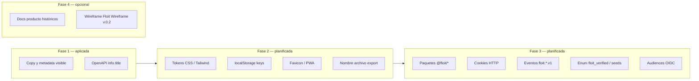

# Plan de rebranding: Floit → QueGym

Documento de planificación y estado del cambio de marca. La **Fase 1** está aplicada en runtime (mayo 2026). Las fases 2–4 son **planificadas** y no deben ejecutarse sin PR dedicado y criterios de migración explícitos.

## Objetivo

Sustituir la marca visible **Floit** por **QueGym** en producto (UI, metadata, copy transaccional y títulos OpenAPI) **sin romper** contratos HTTP, sesiones, analytics, datos persistidos ni pipelines CI.

## Convenciones de naming (producto)

| Contexto | Nombre oficial |
|----------|----------------|
| Marca pública / usuario | **QueGym** |
| Portal y copy partner | **QueGym Partners** |
| Backoffice admin | **QueGym Admin** |
| Logo en UI (Fase 1) | Texto **QueGym** (sin isotipo gráfico; monograma **Q** en header/sidebars) |

Fuente única en código: `apps/web/src/lib/brand.ts` (`BRAND_NAME`, `BRAND_PARTNERS`, `BRAND_ADMIN`).

Componente compartido: `packages/ui/src/floit-logo.tsx` → `QueGymLogo` (alias `FloitLogo` deprecado).

## Principio: capas de cambio



| Capa | Riesgo si se cambia de golpe | Estrategia |
|------|------------------------------|------------|
| Copy UI / SEO | Bajo | Fase 1 — hecho |
| Design tokens / storage cliente | Medio | Fase 2 con alias y migración |
| Contratos, cookies, eventos, DB | Alto | Fase 3 con versionado o dual-read |
| Documentación histórica / carpeta wireframe | Nulo en runtime | Fase 4 editorial |

---

## Fase 1 — Marca visible (COMPLETADA)

**Estado:** `Completado` (mayo 2026).

### Alcance implementado

- **`apps/web/src/lib/brand.ts`:** constantes de marca.
- **UI pública:** `floit-main-header.tsx` (texto QueGym, icono Q, aria-label), home, `/buscar`, `/comparar`, `/favoritos`, `/privacidad`, `/gyms/[slug]` (copy, WhatsApp, badges «Verificado QueGym» cuando `verificationStatus === floit_verified`).
- **Partner:** login, claim (`claim-wizard.tsx`), panel, configuración, metadata `title`/`description`.
- **Admin:** login, sidebar, leads (modal), analytics, catálogo, taxonomías, duplicados, moderación, partner-claims, configuración.
- **`@floit/ui`:** `QueGymLogo` con texto «QueGym».
- **OpenAPI:** `info.title` en `catalog.yaml`, `search.yaml`, `leads.yaml`, `partner.yaml`, `analytics.yaml` → prefijo «QueGym … API».
- **E2E:** `e2e/partner-claim.spec.ts` — heading «Tu centro en QueGym».
- **Docs operativos:** `AGENTS.md`, `README.md`, entradas en `CHANGELOG.md`, `sprints.md`, `EPICS_USER_STORIES_STATUS.md`, `PROJECT_CONTEXT_HANDOVER.md`.

### Sin cambio (intencional en Fase 1)

| Identificador | Ubicación típica | Motivo |
|---------------|------------------|--------|
| `@floit/*` | `package.json`, imports | Rompe workspace y CI |
| `--floit-*` | `globals.css`, `tokens.ts`, Tailwind `floit.*` | Tokens de diseño internos |
| `floit:favorites`, `floit:compare` | `floit-favorites.ts`, `floit-compare.ts` | Datos en navegadores de usuarios |
| `floit-admin-duplicate-dismissed` | `duplicados-client.tsx` | Preferencia admin local |
| Cookies `floit_partner_*`, `floit_admin_*` | BFF / sesión | Sesiones activas |
| `floit_verified` | API / DB / `venue-badges` | Contrato y datos |
| Eventos `floit.*.v1` | `packages/contracts`, `contracts/events/` | Consumidores analytics |
| OIDC `floit-admin`, audiences legacy | env / IdP | Configuración despliegue |
| Nombres de archivo `floit-main-header.tsx`, `floit-logo.tsx` | Rutas estables | Refactor cosmético → Fase 2+ |
| Export CSV `floit-leads.csv` | `api/admin/leads/export` | Enlaces guardados por ops |
| Carpeta repo `FLOIT v.0.2`, wireframe `Floit Wireframe v.0.2/` | Referencia UX | No es runtime |

### Verificación Fase 1

```bash
# Sin "Floit" visible en src web
rg '\bFloit\b' apps/web/src

# Typecheck web
pnpm --filter @floit/web exec tsc --noEmit
```

Prueba manual: home, `/partner/login`, `/partner/claim`, `/admin/login`, ficha con badge verificado, metadata en pestaña del navegador.

---

## Fase 2 — Tokens, assets y storage cliente (PLANIFICADA)

**Estado:** `Pendiente`. No aplicar junto con Fase 1; requiere migración y QA en dispositivos reales.

### Alcance propuesto

| Ítem | Cambio | Migración |
|------|--------|-----------|
| CSS | Variables canónicas `--quegym-*` con alias `--floit-*` en `:root` | Mantener alias ≥ 1 release |
| `packages/ui` / Tailwind | Referencias a `--quegym-*`, tema `quegym.*` (deprecar `floit`) | Actualizar componentes base |
| Favicon / apple-touch | `app/icon.tsx`, `app/apple-icon.tsx` (letra Q) | N/A |
| Layout metadata | `applicationName`, `appleWebApp.title` | N/A |
| `localStorage` | `quegym:favorites`, `quegym:compare`, `quegym-admin-duplicate-dismissed` | Módulo `storage-keys.ts`: leer legacy `floit:*`, escribir canónico |
| Export admin | `quegym-leads.csv` | Opcional: dual filename o comunicar a ops |

### Criterios de salida

- QA visual en `/`, `/buscar`, componentes `@floit/ui`.
- Favoritos/comparar/duplicados conservan datos tras actualizar (migración probada).
- Sin regresión en `pnpm verify` y smoke E2E.

### Estimación

1 PR acotado (frontend + `packages/ui`); sin tocar servicios.

---

## Fase 3 — Identificadores técnicos (PLANIFICADA)

**Estado:** `Pendiente`. Coordinar con despliegue, analytics y partners de integración.

### Alcance propuesto (orden sugerido)

1. **Eventos:** nuevos tipos `quegym.*.v1` (o v2) en JSON Schema + dual-publish desde servicios; periodo de lectura dual en analytics.
2. **API / DB:** `quegym_verified` (o campo display separado) con migración SQL y compat en lectura de `floit_verified`.
3. **Cookies:** renombrar con transición (set nuevo + leer ambos en middleware).
4. **Paquetes npm:** `@quegym/web` etc. — solo con ventana de mantenimiento (cambio masivo en monorepo).
5. **OIDC / env:** nuevos client IDs / audiences en staging antes de prod.
6. **Seeds y ejemplos:** emails `*@quegym.*` en catalog/partner seed.

### Riesgos

- Sesiones invalidadas al renombrar cookies.
- Dashboards analytics sin eventos históricos si no hay dual-read.
- Integraciones externas que parsean `floit_verified` o nombres de evento.

### Criterios de salida

- Runbook de migración en `DEPLOY_TEST_RUNBOOK.md`.
- Evidencia staging (gates + smoke con OIDC real).
- ADR si se versionan eventos o se renombran paquetes.

---

## Fase 4 — Documentación y referencias históricas (OPCIONAL)

**Estado:** `Backlog editorial`.

- Actualizar títulos en `docs/product/*.md` (PRD, BACKLOG) de Floit → QueGym donde describan el producto actual.
- Mantener `Floit Wireframe v.0.2/` y `docs/archive/` como referencia histórica hasta retirar el wireframe.
- Convención Figma: `docs/ux/FIGMA_TAXONOMY_MAPPING.md` — término «Floit actual» → «QueGym (runtime)».

No bloquea releases de producto.

---

## Mapa rápido de archivos (Fase 1)

| Área | Archivos clave |
|------|----------------|
| Marca | `apps/web/src/lib/brand.ts` |
| Header | `apps/web/src/app/floit-main-header.tsx` |
| Logo UI | `packages/ui/src/floit-logo.tsx` |
| OpenAPI | `openapi/*.yaml` (`info.title`) |
| Badge verificado | `apps/web/src/lib/venue-badges.ts`, `gyms/[slug]/page.tsx` |
| Tests | `apps/web/e2e/partner-claim.spec.ts` |

---

## Registro de decisiones

| Fecha | Decisión |
|-------|----------|
| 2026-05 | Ejecutar solo **Fase 1** para no romper integridad de plataforma. |
| 2026-05 | Partners = **QueGym Partners**; logo solo texto **QueGym**. |
| 2026-05 | Fase 2 (tokens/storage/favicon) **no** incluida en el mismo ciclo que Fase 1. |

---

## Referencias

- Estado de sprint: `docs/operations/sprints.md` (§ Rebrand Fase 1).
- Épicas: `docs/operations/EPICS_USER_STORIES_STATUS.md`.
- Handover: `docs/operations/PROJECT_CONTEXT_HANDOVER.md`.
- Changelog: `docs/operations/CHANGELOG.md` → `[Unreleased]`.
- Agentes: `AGENTS.md` (producto QueGym).
