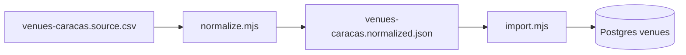

# Importación masiva de venues (catálogo Caracas)

Pipeline para cargar el CSV de gimnasios en **catalog-service** (`venues` en Postgres) sin perder columnas del Excel/CSV original.

## Staging (Neon vía Railway catalog)

```bash
export CATALOG_SERVICE_URL=https://floitcatalog-service-production.up.railway.app
export CATALOG_INTERNAL_API_TOKEN=<token-del-vault>
pnpm venues:import:staging
pnpm venues:validate:live
```

Requiere `GET /health` → `{"ok":true,"service":"catalog"}`. Si responde 502, redeploy del servicio catalog en Railway tras actualizar `main` (bind `0.0.0.0`).

---

## Requisitos

1. Postgres: `pnpm docker:up`
2. Catalog en marcha: `pnpm dev:services` (puerto **4010**)
3. Token interno alineado (dev por defecto `change-me-dev-only`):
   - `CATALOG_INTERNAL_API_TOKEN` en `services/catalog`
   - Opcional en shell: `export CATALOG_INTERNAL_API_TOKEN=change-me-dev-only`

**Nota:** Con `SEED_ON_BOOT=true` el seed demo (8 venues en `seed.service.ts`) **solo corre si la tabla `venues` está vacía**. En el entorno operativo actual (mayo 2026) la BD local tiene **~95 venues importados** y los demos fueron **eliminados**; reiniciar catalog **no** restaura `oxide-chacao` ni el resto del seed. El import **no borra** filas: es idempotente por `slug` (alta o actualización).

## Flujo



### 1. Normalizar

```bash
pnpm venues:normalize
```

- Lee `data/venues-caracas.source.csv` (o `VENUES_SOURCE_CSV=/ruta/al.csv`).
- Genera slugs, taxonomía (`venueType`, `modalities`, `amenities`), teléfonos, precios, fotos.
- Geocodifica: coordenadas en URL Maps → caché → Nominatim (1 req/s) → fallback centro Caracas (marcado en descripción).
- Preserva **todas** las columnas originales en `record.source`.
- Texto no mapeable a columnas DB va en `description` (horario, Instagram, planes literales, rating, etc.).

Opciones:

- `--skip-geocode` — solo URLs/caché (sin Nominatim).

### 2. Importar

```bash
pnpm venues:import
```

- `POST /v1/internal/venues` con payload completo (alta o **actualización** si el slug existe).
- `POST /v1/internal/venues/:slug/partner-sync` para planes estructurados y refuerzo de descripción/fotos.

Variables:

| Variable | Default |
|----------|---------|
| `CATALOG_SERVICE_URL` | `http://localhost:4010` |
| `CATALOG_INTERNAL_API_TOKEN` | `change-me-dev-only` |
| `VENUES_IMPORT_CONCURRENCY` | `4` |

```bash
pnpm venues:import:dry    # simulación
pnpm venues:load          # normalize + import
```

### 3. Validar

```bash
pnpm venues:validate
pnpm venues:validate:live   # requiere catalog arriba
```

Revisar en UI: `/buscar`, `/admin/catalogo`, `/admin/duplicados`.

## Qué se guarda dónde

| Dato fuente | Destino en plataforma |
|-------------|------------------------|
| Nombre, zona, categoría | `name`, `zone`, `venueType` |
| Actividades / amenidades | `modalities[]`, `amenities[]` (slugs) |
| Teléfono | `contactPhone`, `contactWhatsapp` |
| Precios parseados | `priceMin`, `priceMax` |
| Fotos HTTP | `photoUrls[]` (máx. 12) |
| Planes (texto) | `plans[]` en partner-sync + texto en `description` |
| Horario, IG, maps, rating, textos largos | `description` + `source` en JSON |
| Coordenadas | `lat`, `lng` (+ nota en descripción si fallback) |
| Fila CSV completa | `source` en `venues-caracas.normalized.json` |

## Actualizar el catálogo

1. Sustituir `data/venues-caracas.source.csv`.
2. `pnpm venues:normalize`
3. `pnpm venues:import` (idempotente por `slug`).

## Normalización homogénea (pipeline)

El paso `normalize.mjs` aplica reglas en `scripts/venues-import/lib/`:

| Campo | Regla |
|-------|--------|
| `name` | `normalizeVenueName` — trim, espacios, capitalización |
| `zone` | `normalizeZone` — municipios canónicos (Chacao, Baruta, Libertador, Sucre, El Hatillo, Guatire, Guarenas, San Antonio de los Altos); calles/av. → Libertador |
| `venueType` | `mapVenueType` — prioriza **categoría** del CSV (evita clasificar gimnasios integrales como pilates por una actividad secundaria) |
| `modalities` / `amenities` | Slugs taxonomía en `mappings.mjs` |
| `contactPhone` / `contactWhatsapp` | E.164 Venezuela (`58…`) |
| `priceMin` / `priceMax` | USD, Bs. y patrones «mensual» |
| `lat` / `lng` | Maps URL → caché → Nominatim → **centroide por zona** (no un único punto Caracas) |
| `description` | Bloques estructurados + pie «importación normalizada» |

Auditoría: `pnpm venues:audit` (JSON vs API).

## Limitaciones conocidas

- Imágenes `data:image/base64` no se importan (no son URL públicas); el texto sigue en `source.images`.
- Enlaces `share.google` cortos pueden requerir geocodificación por nombre si no redirigen a coordenadas.
- Padel y modalidades nuevas crean slugs que `/admin/taxonomias` puede activar tras `syncMissingSlugsFromVenues`.
