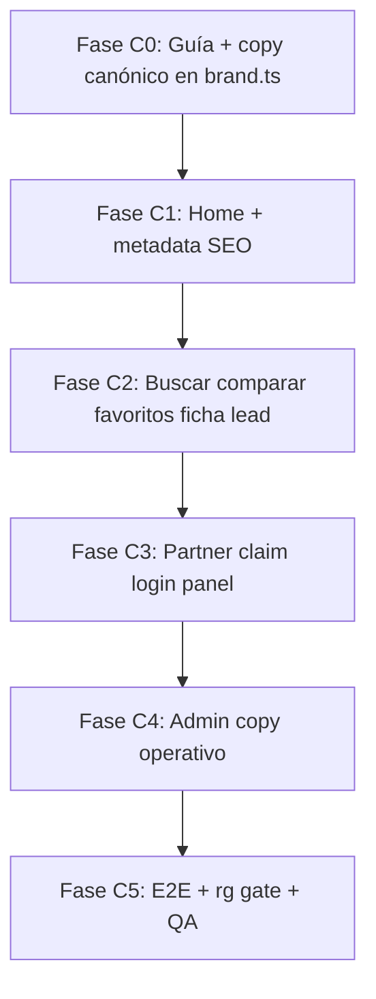

# QueGym — plan de copy verbal (manual de marca · Venezuela)

Plan para alinear **todo el texto visible del producto** al manual de marca QueGym: tono **directo, local y honesto**, con **tuteo venezolano** (tú / imperativo estándar), **sin voseo rioplatense** (`encontrá`, `podés`, `tenés`, etc.).

Complementa la Fase 1 (marca «QueGym») y la Fase 2 visual ([`QUEGYM_BRAND_UI_IMPLEMENTATION_PLAN.md`](./QUEGYM_BRAND_UI_IMPLEMENTATION_PLAN.md)). **No cambia** contratos API, eventos ni identificadores técnicos.

---

## 1) Referencias obligatorias

| Recurso | URL | Uso |
|---------|-----|-----|
| **Propuesta de marca v1** | [propuestademarca.netlify.app](https://propuestademarca.netlify.app/) | Esencia, posicionamiento, eslogan, **tono de voz** (§07), ejemplos «Así sí / Así no» |
| **UI con marca aplicada** | [quegymconmarcaaplicada.netlify.app](https://quegymconmarcaaplicada.netlify.app/) | Copy de referencia para **home** y CTAs partner (hero, subtítulo, banner, chips) |
| Manual accionable (repo) | Paleta, tipografía, WCAG | Coherencia con Fase 2 UI |
| [`REBRAND_QUEGYM_PLAN.md`](../operations/REBRAND_QUEGYM_PLAN.md) | Fases globales | Tracking operativo |

---

## 2) Principios de voz (manual §07)

| Principio | Regla práctica |
|-----------|----------------|
| **Directo** | Frases cortas. Lo útil primero. |
| **Local** | Tuteo venezolano: *Encuentra*, *Compara*, *¿Tienes…?* — **nunca** *Encontrá*, *vos*, *podés*. |
| **Motivador** | Energía sin gritos ni «¡¡¡OFERTA!!!». |
| **Honesto** | Precios orientativos, «sin comisiones escondidas», contacto directo — sin corporativismo vacío. |

### Eslogan y líneas madre

| Uso | Copy canónico |
|-----|---------------|
| Hero H1 | **Encuentra tu próximo gym en Caracas** |
| Subtítulo hero | **Compáralos** por zona, precio, modalidades y amenidades. **Contacta** directo por WhatsApp, **sin intermediarios**. |
| Eslogan corto | **Encuentra tu gym.** |
| Esencia | La respuesta a «¿qué gym?» — **QueGym**. |
| Partner banner | **¿Tienes un gimnasio en Caracas?** → **Registra** tu centro, **recibe** leads reales y **gestiona** tu perfil gratis. **Sin comisiones escondidas.** |
| CTA partner | **Reclamar mi centro** (no «Reclamá») |

### Evitar (manual «Así no»)

- Voseo: *Encontrá*, *Compará*, *Registrá*, *Tenés*, *Podés*, *Elegí*, *Completá*, *Buscá*, *sos*.
- Corporativo: *«Somos la plataforma líder en soluciones de fitness»*.
- Urgencia falsa: *«Regístrate YA!!!»*.

---

## 3) Reglas de conversión (voseo → venezuela)

Aplicar en **UI pública y partner**. Admin puede usar tono **operativo neutro** (imperativo tú o infinitivo), también sin voseo.

| Evitar (voseo / rioplatense) | Usar (venezolano / manual) |
|------------------------------|----------------------------|
| Encontrá | **Encuentra** |
| Descubrí | **Descubre** |
| Compará / comparalos | **Compara** / **Compáralos** |
| Contactá / contactá directo | **Contacta** / **Contacta directo** |
| Empezá | **Empieza** |
| Buscá / buscás | **Busca** |
| Registrá | **Registra** |
| Reclamá | **Reclama** |
| Gestioná | **Gestiona** |
| Recibí | **Recibe** |
| Tenés | **Tienes** |
| Podés | **Puedes** |
| Elegí | **Elige** |
| Completá | **Completa** |
| Iniciá sesión | **Inicia sesión** (ya usado en varias rutas) |
| Agregá | **Agrega** |
| Cambiá | **Cambia** |
| Seleccioná | **Selecciona** |
| Adjuntá | **Adjunta** |
| Arrastrá | **Arrastra** |
| Configurá | **Configura** |
| Ampliá | **Amplía** |
| Revisá / aprobá | **Revisa** / **Aprueba** |
| sos (administrador) | **eres** administrador |
| vos podés | **puedes** |

**Acentuación:** imperativos con tilde cuando corresponda (*Compáralos*, *Elige*, *Completa*).

**Metadata SEO:** alinear `title` y `description` en `layout.tsx` al eslogan (*Encuentra y compara gimnasios en Caracas*).

---

## 4) Copy de referencia por pantalla

Tomado de [quegymconmarcaaplicada.netlify.app](https://quegymconmarcaaplicada.netlify.app/) y [propuestademarca.netlify.app](https://propuestademarca.netlify.app/).

### Home `/`

| Elemento | Copy objetivo |
|----------|---------------|
| H1 | Encuentra tu próximo **gym** en Caracas |
| Lead | Compáralos por zona, precio, modalidades y amenidades. Contacta directo por WhatsApp, sin intermediarios. |
| Search placeholder | Zona o municipio… / ¿Qué tipo de gimnasio **buscas**? |
| Ubicación | Usar mi ubicación |
| Stats strip | 95 centros · 8 municipios · 0 comisiones escondidas · Contacto directo por WhatsApp |
| Sección tipos | Explora por tipo de centro |
| Destacados | Destacados en Caracas · Ver todos → |
| Banner partner | ¿Tienes un gimnasio en Caracas? · Registra tu centro… · Reclamar mi centro → |

### Buscar `/buscar`

| Elemento | Copy objetivo |
|----------|---------------|
| Empty / hint | Puedes ampliar tu búsqueda. |
| Filtros | Mantener labels de taxonomía reales (Gym, CrossFit, Yoga…) |

### Comparar `/comparar`

| Elemento | Copy objetivo |
|----------|---------------|
| Datos incompletos | Contáctalos para confirmar (ya correcto) |

### Partner claim `/partner/claim`

| Elemento | Copy objetivo |
|----------|---------------|
| Metadata | Reclama la ficha… o registra un centro nuevo |
| Paso 1 | Elige tu camino · Elige una opción |
| Reclamo | Encuentra tu ficha en QueGym · Busca por nombre… · Selecciona el centro · Adjunta evidencia |
| Alta | Completa lo básico… |
| Login cross-sell | ¿Ya tienes cuenta de partner? · Inicia sesión… |
| Sesión activa | Puedes seguir con el alta o reclamo… |
| Upload | Arrastra o selecciona un archivo |

### Partner panel / config

| Elemento | Copy objetivo |
|----------|---------------|
| Mis centros | Cambia entre tus gimnasios o agrega uno nuevo |
| Seguridad | Agrega una capa extra de seguridad… |

### Admin

| Elemento | Copy objetivo |
|----------|---------------|
| Leads sospechosos | Revisa leads marcados… (no Revisá) |
| Catálogo | Revisa y aprueba claims… |

---

## 5) Inventario de archivos (estado actual)

Auditoría 2026-05-27 — ocurrencias de voseo o copy desalineado al manual:

| Archivo | Ejemplos actuales | Prioridad |
|---------|-------------------|-----------|
| `apps/web/src/app/page.tsx` | ~~Encontrá, Descubrí…~~ → constantes `brand.ts` | **P0** ✅ C1 |
| `apps/web/src/app/layout.tsx` | ~~metadata Encontrá~~ → `BRAND_META_*` | **P0** ✅ C1 |
| `apps/web/src/app/partner/claim/claim-wizard.tsx` | Migrado C3 | **P0** ✅ |
| `apps/web/src/app/partner/claim/page.tsx` | Migrado C3 | **P0** ✅ |
| `apps/web/src/app/partner/configuracion/mis-centros/page.tsx` | Migrado C3 | **P1** ✅ |
| `apps/web/src/app/partner/partner-panel-client.tsx` | Migrado C3 | **P1** ✅ |
| `apps/web/src/app/buscar/buscar-client.tsx` | Migrado C2 | **P1** ✅ |
| `apps/web/src/app/admin/leads/admin-leads-client.tsx` | Migrado C4 | **P2** ✅ |
| `apps/web/src/app/admin/catalogo/catalogo-client.tsx` | Migrado C4 | **P2** ✅ |

**Fuera de alcance copy:** nombres de variables env en mensajes dev (`ADMIN_CATALOG_DELEGATE_EMAIL`), strings de error técnicos, comentarios de código, E2E que busquen texto legacy (actualizar tras el cambio).

**Verificación automática sugerida:**

```bash
rg -n 'Encontrá|Compará|Contactá|Registrá|Reclamá|Tenés|Podés|Elegí|Completá|Buscá|Iniciá|Agregá|Descubrí|Empezá|Configurá|Revisá|Aprobá|Arrastrá|Seleccioná|Adjuntá|Cambá|gestioná|recibí|buscás|comparalos|contactá|sos administrador| vos ' apps/web/src
# Debe retornar 0 matches en UI (salvo falsos positivos documentados)
```

---

## 6) Fases de implementación



| Fase | Alcance | Estado |
|------|---------|--------|
| **C0** | Este documento; constantes opcionales `BRAND_TAGLINE`, `BRAND_HERO_*` en `brand.ts`; enlace en `docs/index.md` | `Completado` (2026-05-27) |
| **C1** | `/`, `layout.tsx` metadata, header si aplica | `Completado` (2026-05-27) |
| **C2** | `/buscar`, `/comparar`, `/favoritos`, `/gyms/[slug]`, `/lead/*`, `/privacidad` | `Completado` (2026-05-27) — `/buscar` |
| **C3** | `/partner/*` (claim wizard, page, panel, venues, config) | `Completado` (2026-05-27) |
| **C4** | `/admin/*` — tono operativo sin voseo | `Completado` (2026-05-27) — leads + catálogo |
| **C5** | Actualizar E2E; gate `rg` en CI o checklist manual; revisión en staging vs referencias Netlify | `Completado` (2026-05-27) — `pnpm copy:verify`, E2E smoke hero; QA staging manual `Pendiente` |

### Definition of done (Fase C5)

- [x] Cero voseo en `apps/web/src` — `pnpm copy:verify` (CI job `Brand copy gate`).
- [x] Hero y banner partner alineados a [quegymconmarcaaplicada](https://quegymconmarcaaplicada.netlify.app/) vía constantes `brand.ts`.
- [x] Tono según §07 de [propuestademarca](https://propuestademarca.netlify.app/) en rutas migradas C1–C4.
- [x] E2E `smoke.spec.ts` valida H1 «Encuentra tu próximo gym en Caracas».
- [x] Docs operativos actualizados (2026-05-27).
- [ ] QA manual copy + visual en **staging** (`UI_VISUAL_QA_CHECKLIST.md` §2b).
- [ ] Mejora UX v0: tarjetas sin placeholder roto, ficha sin metadatos import ([`QUEGYM_UX_V0_IMPROVEMENT_PLAN.md`](./QUEGYM_UX_V0_IMPROVEMENT_PLAN.md) Sprint UX-A).

Comandos:

```bash
pnpm copy:verify
pnpm --filter @floit/web exec tsc --noEmit
pnpm test:e2e -- e2e/smoke.spec.ts
```

---

## 7) Constantes en `brand.ts` (implementadas)

Ver `apps/web/src/lib/brand.ts`: `BRAND_TAGLINE`, `BRAND_HERO_*`, `BRAND_PARTNER_*`, `BRAND_META_*`, `BRAND_SEARCH_PLACEHOLDER`, `EXPORT_LEADS_CSV_FILENAME`.

---

## Referencias cruzadas

- [`QUEGYM_BRAND_UI_IMPLEMENTATION_PLAN.md`](./QUEGYM_BRAND_UI_IMPLEMENTATION_PLAN.md) — Fase 7 copy
- [`UI_VISUAL_QA_CHECKLIST.md`](./UI_VISUAL_QA_CHECKLIST.md) — § tono verbal
- [`REBRAND_QUEGYM_PLAN.md`](../operations/REBRAND_QUEGYM_PLAN.md) — Fase 2 verbal

*Última actualización: 2026-05-27*
