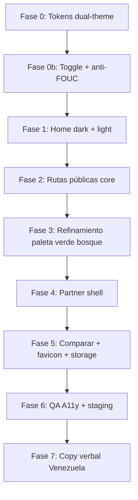

# QueGym — plan de implementación UI (manual de marca + dark/light)

Plan operativo para cerrar el **rebranding visual** alineado al *Manual de marca accionable para QueGym* y las referencias de diseño (capturas home desktop/mobile). Complementa [`REBRAND_QUEGYM_PLAN.md`](../operations/REBRAND_QUEGYM_PLAN.md) Fase 1 (copy) y Fase 2 (tokens).

**Fuente de verdad visual:** manual de marca (paleta, tipografía, componentes, WCAG 2.2 AA) + capturas de referencia en repo/assets.

**Principio:** dos temas de producto (**dark** e **light**) derivados del mismo sistema de tokens; el usuario elige con toggle persistente. **Dark** es el default de marca (referencias actuales); **light** sigue la misma gramática cromática sobre fondos claros.

---

## 1) Sistema de color dual (tokens semánticos)

No hardcodear HEX en componentes. Definir tokens **semánticos** que cambian por tema:

| Token semántico | Dark (default) | Light | Uso |
|-----------------|----------------|-------|-----|
| `--qg-bg-page` | `#050a05` (verde bosque) | White `#FFFFFF` | Fondo página |
| `--qg-bg-elevated` | `#141c14` | White `#FFFFFF` | Cards, modales |
| `--qg-bg-subtle` | `#0f160f` | Mist `#EAFBF4` | Secciones alternas |
| `--qg-bg-input` | `#162116` | White + borde Slate | Search, placeholders |
| `--qg-bg-hero` | = page (continuo) | Mist `#EAFBF4` | Hero home |
| `--qg-bg-banner` | `#141c14` | Mist `#EAFBF4` | Banner partner CTA |
| `--qg-text-primary` | White `#FFFFFF` | Ink `#111827` | Títulos, body principal |
| `--qg-text-secondary` | `#8a968a` (verde-gris) | Slate `#6B7280` | Metadata, labels |
| `--qg-text-on-accent` | White `#FFFFFF` | White `#FFFFFF` | Texto sobre Mint (CTAs) |
| `--qg-border` | `#243528` | `#E5E7EB` | Bordes cards/inputs |
| `--qg-accent` | Mint `#12B76A` | Mint `#12B76A` | **CTA primario**, botones, bordes activos, focus ring |
| `--qg-accent-hover` | `#0ea85e` | `#0f9d58` | Hover CTA (= `--qg-highlight-hover`) |
| `--qg-highlight` | Mint `#12B76A` | Mint `#12B76A` | Alias visual de accent; links, ratings, énfasis |
| `--qg-highlight-hover` | `#0ea85e` | `#0f9d58` | Hover interactivo |
| `--qg-green` | `#00875A` | `#00875A` | Referencia manual (no CTAs en UI) |
| `--qg-highlight-soft` | `rgba(18,183,106,0.12)` | Mist `#EAFBF4` | Chips selected, badges |
| `--qg-ink` | `#111827` | `#111827` | Texto light; paneles partner (Ink) |
| `--qg-warning` | Amber `#F59E0B` | Amber `#F59E0B` | Promos, atención |
| `--qg-error` | Red `#D92D20` | Red `#D92D20` | Errores |

**Implementación:** `apps/web/src/app/globals.css`, `apps/web/tailwind.config.ts` (`quegym.*`).

**Alias legacy:** mantener `--floit-*` apuntando a `--qg-*` durante ≥1 release.

**Contraste (manual WCAG 2.2 AA):**

| Par | Ratio | Tema |
|-----|-------|------|
| Ink sobre White | 17.74:1 | Light body |
| White sobre Ink | 17.74:1 | Dark body |
| White sobre Mint (accent) | ≥ 4.5:1 | CTA primario (ambos) |
| Ink sobre Mist | 16.56:1 | Light chips/badges |
| Slate sobre White | 4.83:1 | Light metadata |

**Focus ring:** 2px blanco (dark) / Ink (light) + sombra **Mint** externa (`--qg-accent`).

> **Decisión 2026-05-27:** `--qg-accent` y `--floit-color-primary` usan **Mint `#12B76A`**. Green `#00875A` permanece como `--qg-green` solo como referencia de paleta del manual.

---

## 2) Toggle dark / light mode

### Comportamiento

| Regla | Definición |
|-------|------------|
| Default público | **Dark** (marca) |
| Default admin/partner | **Light** (sin preferencia guardada) |
| Persistencia | `localStorage` clave canónica `quegym:theme` (`light` \| `dark`); leer legacy `floit:theme` una vez y migrar |
| Aplicación | Atributo `data-theme="dark"` \| `data-theme="light"` en `<html>` |
| SSR / hidratación | Script inline mínimo en `layout.tsx` **antes** del paint (FOUC) |
| Toggle UI | Icono + label «Modo claro» / «Modo oscuro» |
| Alcance | Flujo **público** + **`/admin/*`** + **`/partner/*`** |
| Analytics | **No** emitir evento al cambiar tema |

### Archivos

| Archivo | Rol |
|---------|-----|
| `apps/web/src/lib/theme.ts` | Tipos, storage, resolve initial theme |
| `apps/web/src/app/theme-script.tsx` | Inline script anti-FOUC |
| `apps/web/src/components/theme-toggle.tsx` | Botón cliente |
| `apps/web/src/app/floit-main-header.tsx` | Toggle header público |
| `apps/web/src/app/admin/admin-sidebar.tsx` | Toggle admin |
| `apps/web/src/app/partner/layout.tsx` | Toggle partner |
| `apps/web/src/app/globals.css` | Bloques `[data-theme="dark"]` y `[data-theme="light"]` |
| `packages/ui/src/*` | Componentes consumen tokens semánticos |

---

## 3) Light mode — criterios de marca (manual)

El light mode **no** es “invertir negro/blanco”: es la variante **Mist + White + Ink + Mint** del manual.

### Superficies

| Elemento | Light mode |
|----------|------------|
| Página | Fondo **White** |
| Hero | Fondo **Mist** (`--qg-bg-hero`) |
| Cards gym | Fondo **White**, borde `#E5E7EB` |
| Search bar | Fondo White, borde Slate claro |
| Banner partner | Fondo **Mist**; CTA **Mint** sólido |
| Header | Fondo White/95 + blur; logo Q circular **Mint** |

### Componentes (manual § sistema UI)

| Componente | Dark | Light |
|------------|------|-------|
| Botón primario | Mint + White | Mint + White |
| Botón WhatsApp | Mint (= accent) | Mint |
| Chip filtro activo | Borde Mint + fondo soft + texto Mint | Idem sobre Mist |
| Badge Verificado | Mint soft + borde Mint | Idem |
| Badge Destacado | Mint sólido + White | Idem |
| Links «Ver todos», «Limpiar» | Mint | Mint |

---

## 4) Fases de implementación



### Estado por fase

| Fase | Alcance | Estado |
|------|---------|--------|
| 0 / 0b | Tokens, toggle, tipografías, `@floit/ui` base | `Completado` |
| 1 | Home `/` ambos temas | `Completado` |
| 2 | `/buscar`, `/favoritos`, `/gyms/[slug]`, `/privacidad`, `/lead/*` | `Completado` |
| 3 | Paleta dark verde bosque; acentos; hero continuo; cards/buscar/ficha | `Completado` (2026-05-27) |
| 4 | `/partner/login`, `/partner/claim`, `/partner` entry | `Completado` (2026-05-27) |
| 5 | `/comparar`; favicon; migración `localStorage` | `Completado` (2026-05-27) |
| 5b | `/privacidad`, `/lead/*`; `UICard` elevación global | `Completado` (2026-05-27) |
| 6 | Partner panel interno; admin shells; QA staging | `Completado` (2026-05-27); QA staging `Pendiente` |
| 7 | Copy verbal — manual de marca, tuteo venezolano (sin voseo) | `Completado` (2026-05-27) — [`QUEGYM_BRAND_COPY_PLAN.md`](./QUEGYM_BRAND_COPY_PLAN.md); QA copy staging manual `Pendiente` |

---

Comandos:

```bash
pnpm copy:verify
pnpm --filter @floit/web exec tsc --noEmit
pnpm test:e2e -- e2e/smoke.spec.ts
```

---

## 5) QA y definition of done

| Check | Dark | Light |
|-------|------|-------|
| Fondo página | Verde bosque `#050a05` | White |
| CTA primario | White/Mint AA | White/Mint AA |
| WhatsApp / links activos | Mint | Mint |
| Chips selected | Borde + fondo soft Mint | Idem |
| Toggle | Persiste + sin FOUC | Idem |
| Focus visible | Ring blanco + Green | Ring Ink + Green |

Comandos:

```bash
pnpm copy:verify
pnpm --filter @floit/web exec tsc --noEmit
pnpm test:e2e -- e2e/smoke.spec.ts
```

---

## 6) Decisiones cerradas

1. **Admin/partner:** default **light**; **toggle habilitado** (no light fijo).
2. **Blog** en header → omitido hasta existir ruta.
3. **Ratings en cards** → solo con dato real (pendiente backend).
4. **Dark default** en flujo público; referencias visuales = verde bosque, no gris Ink plano.
5. **Copy verbal:** tuteo venezolano (*Encuentra*, *Compara*); **prohibido voseo** (*Encontrá*, *podés*) — plan [`QUEGYM_BRAND_COPY_PLAN.md`](./QUEGYM_BRAND_COPY_PLAN.md); referencias [propuesta de marca](https://propuestademarca.netlify.app/) y [UI aplicada](https://quegymconmarcaaplicada.netlify.app/).

---

## Referencias

- [`QUEGYM_BRAND_COPY_PLAN.md`](./QUEGYM_BRAND_COPY_PLAN.md) — copy verbal, tono Venezuela, anti-voseo
- Manual de marca (paleta, tipografía, UI kit, WCAG)
- [`REBRAND_QUEGYM_PLAN.md`](../operations/REBRAND_QUEGYM_PLAN.md)
- [`FIGMA_UI_UX_MIGRATION_PLAN.md`](./FIGMA_UI_UX_MIGRATION_PLAN.md)
- [`UI_VISUAL_QA_CHECKLIST.md`](./UI_VISUAL_QA_CHECKLIST.md)
- Capturas referencia: assets del repo (home, buscar, ficha — dark mode)

---

## 7) Elevación y motion (prueba UX — referencia Apple)

Utilidades en `globals.css` (`@layer components`). Combinar con `qg-motion` para transiciones suaves (~320ms, easing Apple).

| Clase | Uso |
|-------|-----|
| `qg-surface` | Cards principales — sombra media + lift `-3px` en hover |
| `qg-surface-subtle` | Buscadores, chips, paneles — sombra ligera + lift `-2px` |
| `qg-btn-primary` | CTAs Mint — sombra acento + scale sutil en hover |
| `qg-btn-ghost` | Botones outline — sombra ligera en hover |
| `qg-fab` | FAB mapa / WhatsApp circular |
| `qg-chip` | Pills de categoría/zona |
| `qg-header-bar` | Header sticky con blur |
| `qg-nav-link` / `qg-link-hover` | Links de navegación |

Reglas: hover solo en `@media (hover: hover)`; respeta `prefers-reduced-motion`.

**Alcance prueba (2026-05-27):** `/`, `/buscar`, `/comparar`, `/favoritos`, `/gyms/[slug]`, `/privacidad`, `/lead/*`, partner login/claim/entry/**panel/venues/config**, admin **shell + login**, header, `@floit/ui` `UICard` + `UIButton`.

*Última actualización: 2026-05-27 — accent = Mint + elevación Apple*
