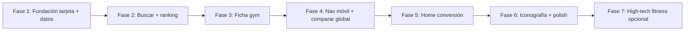

# QueGym — plan de mejora UX (auditoría v0 + staging)

Plan de implementación derivado del análisis UX sobre **staging.quegym.com** documentado en [v0 — User experience improvement](https://v0.app/vicsanpar1289/chat/user-experience-improvement-gCH896aJPYE) y contrastado con el estado del repo (mayo 2026).

**Objetivo:** cerrar fugas de **confianza** y **conversión** en discovery (buscar + ficha) y **navegación móvil**, sin romper contratos MVP ni flujos lead/compare/favoritos.

**Complementa (no reemplaza):**

- [`QUEGYM_BRAND_UI_IMPLEMENTATION_PLAN.md`](./QUEGYM_BRAND_UI_IMPLEMENTATION_PLAN.md) — tokens, dual-theme, rebrand visual ✅
- [`QUEGYM_BRAND_COPY_PLAN.md`](./QUEGYM_BRAND_COPY_PLAN.md) — tono venezolano ✅
- [`UI_VISUAL_QA_CHECKLIST.md`](./UI_VISUAL_QA_CHECKLIST.md) — QA manual
- [`FIGMA_UI_UX_BACKLOG.md`](./FIGMA_UI_UX_BACKLOG.md) — backlog wireframe histórico

**Referencias de diseño:**

| Fuente | URL | Uso |
|--------|-----|-----|
| Auditoría + prototipo v0 | [v0 chat UX improvement](https://v0.app/vicsanpar1289/chat/user-experience-improvement-gCH896aJPYE) | Diagnóstico y home prototipo |
| Manual / copy | [propuestademarca.netlify.app](https://propuestademarca.netlify.app/) | Tono y promesa |
| UI aplicada | [quegymconmarcaaplicada.netlify.app](https://quegymconmarcaaplicada.netlify.app/) | Hero, banner partner |

---

## 1) Diagnóstico resumido (validado en código)

| Área | Problema observado (v0 / staging) | Evidencia en repo |
|------|-------------------------------------|-------------------|
| `/buscar` | Tarjetas sin foto, “Consultar precio”, percepción de catálogo abandonado | `alt="Imagen de…"`, placeholders grises, sin fallback de iniciales |
| `/gyms/[slug]` | Descripción con metadatos de import (`cache:`, `fuente:`, URLs crudas) | `venue.description` renderizado sin sanitizar |
| `/gyms/[slug]` | Galería “Foto 2”, sidebar “Logo”, horarios/planes genéricos | `page.tsx` placeholders literales |
| Precios | Rangos amplios sin jerarquía “Desde $X/mes” | `formatPriceLevel` en buscar/home |
| Móvil | Nav principal oculta; solo “Favoritos (n)” | `floit-main-header.tsx` `hidden md:flex` |
| Iconografía | Emojis como iconos de producto | Home, buscar, ficha |
| Home | Falta “Cómo funciona”, stats de confianza, footer | Solo hero + categorías + destacados + banner |
| Datos | ~95 venues importados incompletos | `VENUES_CATALOG_IMPORT.md`, `completenessScore` en catalog |

**Ya resuelto en repo (no confundir con staging desactualizado):** rebrand Mint/verde bosque, copy venezolano, `pnpm copy:verify`, elevación `qg-*`.

---

## 2) Principios de implementación

1. **Vertical slices** — cada entrega mejora una ruta completa (UI + datos mínimos + test).
2. **Componentes compartidos** — un solo `VenueCard` / `VenueImage` / `VenuePrice` en `packages/ui` o `apps/web/src/components/`.
3. **Datos reales primero** — no inventar ratings; ocultar o mostrar solo con backend.
4. **Dual-theme** — todo componente nuevo usa tokens `--qg-*` (dark default público).
5. **Sin regresión** — mantener query params, compare (3 max), favoritos, leads, analytics existentes.
6. **Catálogo en paralelo** — mejoras de pipeline import son epic aparte (UX-V0-7).

---

## 3) Fases de entrega (roadmap)



| Fase | Objetivo | Tickets | Estimación |
|------|----------|---------|------------|
| **1** | Componentes base + sanitizar descripción | UX-V0-101 … 104 | ~3–4 d |
| **2** | `/buscar` confiable | UX-V0-201 … 205 | ~3–4 d |
| **3** | `/gyms/[slug]` producto-ready | UX-V0-301 … 306 | ~4–5 d |
| **4** | Shell móvil + comparar persistente | UX-V0-401 … 404 | ~2–3 d |
| **5** | Home educación + confianza | UX-V0-501 … 504 | ~2–3 d |
| **6** | Lucide, skeletons, filtros chip ✕ | UX-V0-601 … 603 | ~2–3 d |
| **7** | Dirección visual “high tech fitness” (v0) | UX-V0-701 | spike + diseño |

**Orden recomendado para empezar implementación:** Fase 1 → 2 → 3 (máximo impacto en confianza).

---

## 4) Backlog detallado

Convenciones: **P0** crítico · **P1** alto · **P2** medio · **S/M/L** = 0.5–1 / 1–2 / 2–3 días dev.

### Epic UX-V0-1 — Fundación componentes venue

| ID | Título | P | Est. | Archivos principales | Criterios de aceptación |
|----|--------|---|------|----------------------|-------------------------|
| **UX-V0-101** | `VenueImage` con fallback iniciales + color por modalidad | P0 | M | `packages/ui/src/venue-image.tsx` (nuevo), export en `index.tsx` | Sin texto “Imagen de…” visible; iniciales 1–2 letras; icono sutil si sin foto; `loading="lazy"`; funciona dark/light |
| **UX-V0-102** | `VenuePrice` — “Desde $X/mes” + rango secundario + “Precio a consultar” | P0 | S | `apps/web/src/lib/venue-price.ts` | Reglas: si solo max → “Desde $max”; rango → primario + secundario; null → “Precio a consultar”; tooltip/disclaimer “referencial” opcional |
| **UX-V0-103** | `VenueProfileBadge` — completo / limitado / verificado | P1 | S | `apps/web/src/lib/venue-badges.ts` (extender) | Badge según `completenessScore` + `verificationStatus`; no mostrar rating inventado |
| **UX-V0-104** | Sanitizar descripción import (`venues-import`) | P0 | M | `apps/web/src/lib/venue-description.ts` (nuevo), usar en ficha | Ocultar bloques `cache:`, `fuente:`, coords crudas, URLs maps embebidas; extraer Instagram/teléfono a links; resto legible para usuario |

**Dependencias:** ninguna. **Bloquea:** UX-V0-201, UX-V0-301.

---

### Epic UX-V0-2 — Búsqueda y resultados (`/buscar`)

| ID | Título | P | Est. | Archivos principales | Criterios de aceptación |
|----|--------|---|------|----------------------|-------------------------|
| **UX-V0-201** | Refactor tarjetas listado/mapa a `VenueCard` | P0 | L | `buscar-client.tsx`, nuevo `venue-card.tsx` | Usa UX-V0-101/102/103; nombre, zona, tags mínimos siempre visibles |
| **UX-V0-202** | Ranking: boost `completenessScore` en search | P0 | M | `services/catalog` o BFF search; `openapi/search.yaml` si aplica | Orden default degrada perfiles &lt; umbral (ej. 0.55); documentar en `VENUES_CATALOG_IMPORT.md` |
| **UX-V0-203** | CTA “Completar perfil” / “Reclamar” en tarjetas incompletas | P1 | S | `VenueCard` | Link a `/partner/claim` con copy partner; solo si completeness bajo |
| **UX-V0-204** | Filtros activos removibles (chip ✕) | P1 | M | `buscar-client.tsx` | Cada filtro en query string eliminable sin “Limpiar todo”; mantener “Limpiar todo” |
| **UX-V0-205** | Skeleton loading en resultados | P2 | S | `buscar-client.tsx` | Skeleton 4–6 cards en fetch; respeta `prefers-reduced-motion` |

**Dependencias:** UX-V0-101, UX-V0-102. **E2E:** extender `smoke.spec.ts` o `capability-search-profile-compare-lead.spec.ts`.

---

### Epic UX-V0-3 — Ficha de gimnasio (`/gyms/[slug]`)

| ID | Título | P | Est. | Archivos principales | Criterios de aceptación |
|----|--------|---|------|-------------------------|-------------------------|
| **UX-V0-301** | Descripción estructurada (post UX-V0-104) | P0 | M | `gyms/[slug]/page.tsx` | Secciones: resumen, actividades (chips), amenidades; sin metadatos ops |
| **UX-V0-302** | Galería adaptativa (ocultar slots vacíos) | P0 | M | `page.tsx` o `gym-gallery.tsx` | 0 fotos → hero fallback UX-V0-101; N fotos → grid sin “Foto 2” vacío |
| **UX-V0-303** | Logo / avatar sidebar → iniciales o foto | P0 | S | `page.tsx` aside | Eliminar texto “Logo” |
| **UX-V0-304** | Horarios desde `scheduleSummary` o partner | P1 | M | catalog API + `page.tsx` | Si no hay dato → empty state honesto, no tabla demo fija |
| **UX-V0-305** | Planes desde API partner/catalog | P1 | M | `GET` planes por slug | Reemplazar cards demo hardcodeadas cuando hay planes reales |
| **UX-V0-306** | Eliminar rating hardcodeado “★ 4.8 (203)” | P0 | S | `page.tsx` | Ocultar bloque rating hasta fuente real |

**Dependencias:** UX-V0-104, UX-V0-101.

---

### Epic UX-V0-4 — Navegación y comparador global

| ID | Título | P | Est. | Archivos principales | Criterios de aceptación |
|----|--------|---|------|-------------------------|-------------------------|
| **UX-V0-401** | Menú móvil (drawer) en header público | P0 | M | `floit-main-header.tsx`, `mobile-nav-drawer.tsx` | Enlaces: Explorar, Comparar (n), Favoritos (n), Privacidad, Partner; accesible (focus trap, Esc) |
| **UX-V0-402** | Contador comparar global en header | P1 | S | `floit-compare.ts`, header | Lee `quegym:compare`; badge “Comparar (n)”; link a `/comparar?c=…` |
| **UX-V0-403** | Revisar FAB “Ver mapa” + padding listas móvil | P1 | S | `buscar-client.tsx` | Última tarjeta no queda bajo FAB en todas las vistas |
| **UX-V0-404** | Unificar `HomeFavoritesLink` + nav móvil | P2 | S | `home-favorites-link.tsx` | Evitar duplicar “Favoritos” en header móvil |

**Dependencias:** ninguna para 401; 402 independiente.

---

### Epic UX-V0-5 — Home conversión

| ID | Título | P | Est. | Archivos principales | Criterios de aceptación |
|----|--------|---|------|-------------------------|-------------------------|
| **UX-V0-501** | Strip confianza bajo hero (stats dinámicos) | P1 | S | `page.tsx` | Ej.: “N centros · M municipios · contacto directo WhatsApp”; datos de search meta |
| **UX-V0-502** | Sección “Cómo funciona” (3 pasos) | P1 | M | `home-how-it-works.tsx`, `page.tsx` | Buscar → Comparar → Contactar; copy manual QueGym |
| **UX-V0-503** | Destacados con `VenueCard` unificada | P1 | M | `home-featured-card.tsx` → migrar o wrap | Misma UX que buscar (foto, precio, WhatsApp) |
| **UX-V0-504** | Footer público mínimo | P2 | S | `site-footer.tsx`, `layout.tsx` | Privacidad, partner, © QueGym |

**Dependencias:** UX-V0-101, UX-V0-102 para 503.

---

### Epic UX-V0-6 — Iconografía y polish

| ID | Título | P | Est. | Archivos principales | Criterios de aceptación |
|----|--------|---|------|-------------------------|-------------------------|
| **UX-V0-601** | Adoptar Lucide en flujo público | P2 | L | `package.json`, home, buscar, header, ficha | Reemplazar emojis funcionales (📍🔍🏋️☏); mantener accesibilidad `aria-hidden` en decorativos |
| **UX-V0-602** | Skeletons home destacados | P2 | S | `page.tsx`, featured | Mientras carga search API |
| **UX-V0-603** | Extender `VenueCard` a favoritos + comparar | P1 | M | `favoritos/page.tsx`, `comparar-client.tsx` | Paridad visual cross-screen |

**Dependencias:** UX-V0-201.

---

### Epic UX-V0-7 — Calidad de catálogo (datos, paralelo a UI)

| ID | Título | P | Est. | Archivos principales | Criterios de aceptación |
|----|--------|---|------|-------------------------|-------------------------|
| **UX-V0-701** | Pipeline: no persistir metadatos ops en `description` visible | P1 | M | `scripts/venues-import/` | Metadatos en `record.source` JSON; description solo copy usuario |
| **UX-V0-702** | Recalcular `completenessScore` post-import (foto, precio, zone) | P1 | M | catalog `venues.service.ts` | Score refleja foto + precio + contacto |
| **UX-V0-703** | Script auditoría “perfiles listos para UI” | P2 | S | `pnpm venues:audit:ui` (nuevo) | Reporte % con foto, precio, description limpia |

**Dependencias:** coordinar con ops; mejora efecto de UX-V0-202/201.

---

### Epic UX-V0-8 — Dirección “high tech fitness” (opcional, post-MVP UX)

| ID | Título | P | Est. | Notas |
|----|--------|---|------|-------|
| **UX-V0-801** | Spike diseño: high-tech vs manual Mint actual | P2 | M | Decisión producto: ¿evolución de marca o variante marketing? |
| **UX-V0-802** | Prototipo Figma/v0 segunda iteración | P2 | L | Solo tras GO en UX-V0-801 |

**No iniciar** hasta cerrar Fases 1–3.

---

## 5) Definition of done (por fase)

### Fase 1–3 (MVP UX confianza)

- [ ] Cero placeholders literales “Logo”, “Foto 2”, “Imagen de…” en rutas públicas core.
- [ ] Ficha `activa-gym` (o similar import) sin metadatos `venues-import` visibles.
- [ ] `/buscar` ordena perfiles completos antes que incompletos (A/B perceptible en staging).
- [ ] `pnpm copy:verify` + typecheck + E2E smoke verdes.
- [ ] QA manual [`UI_VISUAL_QA_CHECKLIST.md`](./UI_VISUAL_QA_CHECKLIST.md) dark + light en `/`, `/buscar`, `/gyms/[slug]`.

### Fase 4–6 (conversión + polish)

- [ ] Menú móvil con acceso a Comparar y Buscar.
- [ ] Home con “Cómo funciona” + stats.
- [ ] Lucide en header y buscador (mínimo).

---

## 6) Orden de implementación sugerido (primer sprint UX)

**Sprint UX-A (confianza catálogo)** — ~1 semana

1. UX-V0-101 → UX-V0-102 → UX-V0-104  
2. UX-V0-201 → UX-V0-306  
3. UX-V0-301 → UX-V0-302 → UX-V0-303  
4. Tests: unit `venue-description.ts`, E2E smoke buscar + ficha slug conocido  

**Sprint UX-B (discovery + móvil)** — ~1 semana

1. UX-V0-202 → UX-V0-204  
2. UX-V0-401 → UX-V0-402  
3. UX-V0-501 → UX-V0-502  

**Sprint UX-C (paridad + datos)** — ~1 semana

1. UX-V0-603 → UX-V0-601 (parcial)  
2. UX-V0-701 → UX-V0-702  
3. Deploy staging + QA checklist  

---

## 7) Riesgos y mitigaciones

| Riesgo | Mitigación |
|--------|------------|
| Search service no expone `completenessScore` | Extender DTO en catalog/search o sort en BFF web |
| Romper compare/favoritos al refactor tarjetas | `VenueCard` presentacional; lógica en contenedores |
| Lucide aumenta bundle | Import por icono; tree-shaking |
| Staging desactualizado vs main | Deploy tras Sprint UX-A; foto en `STAGING_DEPLOYMENT_STATUS.md` |
| Conflicto “high tech” vs manual Mint | Fase 8 explícitamente gated; Fases 1–6 respetan `--qg-*` |

---

## 8) Verificación y CI

```bash
pnpm copy:verify
pnpm --filter @floit/web typecheck
pnpm test:e2e -- e2e/smoke.spec.ts
# Tras UX-V0-201+
pnpm test:e2e -- e2e/capability-search-profile-compare-lead.spec.ts
```

Opcional post UX-V0-703: `pnpm venues:audit:ui` en CI manual/staging gate.

---

## 9) Trazabilidad

| Documento | Actualizar cuando… |
|-----------|-------------------|
| `docs/operations/sprints.md` | cierre de cada sprint UX-A/B/C |
| `EPICS_USER_STORIES_STATUS.md` | epic UX-V0 marcado Completado/Parcial |
| `PROJECT_CONTEXT_HANDOVER.md` | cambio de prioridad operativa |
| `WEB_ROUTES_PLATFORM.md` | nuevos componentes globales (footer, drawer) |
| `CHANGELOG.md` | entregas user-visible |

---

## 10) Estado de implementación (2026-05-27)

| Fase | Estado | Evidencia en repo |
|------|--------|-------------------|
| 1 Fundación tarjeta | ✅ | `VenueImage`, `VenueCardGrid`, `venue-description.ts` |
| 2 `/buscar` | ✅ | Tarjetas, chips, ranking catalog, `loading.tsx`, `DiscoveryFilterLink` |
| 3 Ficha gym | ✅ parcial | Galería, sanitizar descripción, Lucide; planes demo placeholder |
| 4 Nav + comparar | ✅ | Drawer móvil, `CompareActiveBar`, header compare link |
| 5 Home | ✅ | `home-how-it-works.tsx`, featured + skeleton, footer |
| 6 Lucide + polish | ✅ | Rutas públicas; sin ratings fake; focus `.qg-field`/`.qg-input` |
| 7 Pipeline import | ✅ JSON | `normalize.mjs`; audit UI 100% desc. limpia; **import BD staging pendiente** |
| 8 High-tech spike | ⏸ | UX-V0-801+ opcional |

**Bugfixes comparador (misma iteración):**

- Barra en `/buscar` desaparecía por `position: fixed` dentro de ancestro con `transform` (`qg-motion:hover`) → `CompareActiveBar` renderizado fuera del panel.
- Móvil `/comparar` mostraba tarjetas apiladas en lugar de grilla → `CompareGrid` con columna sticky + scroll horizontal.

**Focus formularios (polish UX-C):**

- El `:focus-visible` global (outline blanco + box-shadow 4px) se aplicaba al `<input>` rectangular dentro de contenedores `rounded-xl` → borde cuadrado grueso visible en home/buscar.
- Fix: inputs/select/textarea sin outline propio; highlight vía `.qg-field:focus-within` en el wrapper; `.qg-input` para campos con borde; `UITextInput`/`UISelect` actualizados en `@floit/ui`.

---

*Creado: 2026-05-27 · Actualizado: 2026-05-27 (cierre UX-A/B/C + focus formularios) · Fuente: auditoría v0 staging + gap analysis repo*
